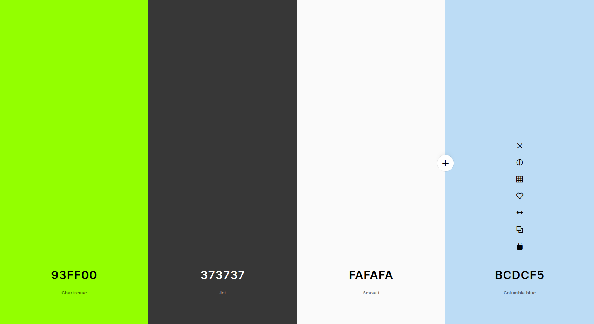

# [CHARLES GEMINI APPAREL](https://charles-gemini-apparel-6a23d410a6ee.herokuapp.com)

[](https://github.com/boderg/charles-gemini-apparel/commits/main)
[](https://github.com/boderg/charles-gemini-apparel/commits/main)
[](https://github.com/boderg/charles-gemini-apparel)

Charles Gemini Apparel is an online clothing retail store specialising in T-Shirts and Hooded Tops with custom design prints.

Charles Gemini Apparel was designed from the ground up by Simon Boylan for their Code Institute Milestome Project 4 and is a fully functioning site utilising the Stripe API for payments and GMail for sending confirmation emails.

Users of the Charles Gemini site are able to create user accounts where they can save their details and orders for future use and view their past orders.

Users are able to send messages to the admin of the Charles Gemini Apparel site through a contact form and users can also sign up with their email to receive newsletters.

*Below is a mockup of the deployed Charles Gemini Apparel site.*


source: [amiresponsive](https://ui.dev/amiresponsive?url=https://charles-gemini-apparel-6a23d410a6ee.herokuapp.com)

## UX

The process for the design of the Charles Gemini Apparel site started as a collection of user stories outlining the purpose and use for the site.

A rough idea was drawn up on paper that would outline the database structure for the Charles Gemini Apparel site.

Wireframes were then created using [Balsamiq](https://balsamiq.com/) to get a general feel for how the site would look.

The Charles Gemini Apparel site was then built using Django, Python, HTML, Bootstrap, CSS,and JavaScript.

### Colour Scheme

The colour scheme chosen for the site was one that would be comfortable on the eye but also inviting, pleasing to navigate and easy to read.

*Below is a colour palette of the colours chosen to fit the scheme.*


source: [coolors.co](https://coolors.co/93ff00-373737-fafafa-bcdcf5)

- `#93ff00` used for top navbar, footer and highlights.
- `#373737` used for text across the site on light backgrounds.
- `#fafafa` used for text on dark backgrounds and buttons.
- `#bcdcf5` used for main body background and image backgrounds.

Variations of these colours were worked to enable the softening of some of the colours with some opacity introduced for effect.

I've used CSS `:root` variables to easily update the global colour scheme, borders, shadows and font by changing only one value, instead of everywhere in the CSS file.

```CSS
:root {
    /** Fonts **/
    --main-font: 'Cuprum', sans-serif;

    /** Colours **/
    --body-background: rgb(188, 220, 245, 0.255);
    --body-background-translucent: rgba(188, 220, 245, 0.855);
    --background: rgb(250, 250, 250);
    --background-translucent: rgba(250, 250, 250, 0.75);
    --background-translucent-2: rgba(250, 250, 250, 0.5);
    --primary-colour: rgb(147, 255, 0);
    --primary-colour-translucent: rgba(147, 255, 0, 0.5);
    --primary-colour-translucent-2: rgba(147, 255, 0, 0.3);
    --primary-colour-translucent-3: rgba(147, 255, 0, 0.7);
    --secondary-colour: rgb(55, 55, 55);
    --secondary-colour-translucent: rgba(55, 55, 55, 0.5);
    --secondary-colour-translucent-2: rgba(55, 55, 55, 0.3);
    --warning-colour: rgb(249, 225, 84);
    --error-colour: rgb(200, 50, 50);
    --info-colour: rgb(64, 166, 206);
    --success-colour: rgb(147, 255, 0);

    /** Shadows **/
    --big-box-shadow: 1px 1px 10px rgb(55, 55, 55);
    --small-box-shadow: 1px 1px 5px rgb(55, 55, 55);
    --small-box-shadow-invert: 1px 1px 5px rgb(250, 250, 250);
    --big-inset-box-shadow: inset 1px 1px 5px rgb(55, 55, 55);
    --small-inset-box-shadow: inset 1px 1px 3px rgb(55, 55, 55);
    --text-shadow: 1px 1px 1px rgb(55, 55, 55);

    /** Borders **/
    --thin-border: 1px solid rgb(55, 55, 55);
    --border-radius: 3px;

    /** Other **/
    --transition-quick: all 0.2s ease-in-out;
}
```

### Typography

Only one font was chosen for the Charles Gemini Apparel site.

[Cuprum](https://fonts.googleapis.com/css2?family=Cuprum:ital,wght@0,400..700;1,400..700&display=swap)

- This [Google](https://fonts.google.com/) font was chosen because it is the font used in the Logo, has a clean and modern style and scales nicely for the purpose of the site.

Two sources were used for the icons acros the Charles Gemini Apparel site.

[UXWing](https://uxwing.com/)

- These icons were used across the Charles Gemini Apparel site as they add a certain style that compliments the site along with a splash of colour. They are also available as SVG's which allowed for easy colour changing to match the site as all black icons were re-coloured to `#373737` to match the font and the magnifying glass re-coloured from blue to `#93ff00`.

[Font Awesome](https://fontawesome.com/)

- A few Font Awesome icons were used, namely for the plus and minus buttons and the left arrow on some back buttons. These were used as there were either no UXWing equivalents or the UXWing equivqlent did not match the site aesthetic.

## User Stories

### New Site Users

- As a new site user, I would like to be able to easily browse through all the t-shirts and hooded tops on the website, filtered by category, so that I can quickly find something that interests me.
- As a new site user, I would like to be able to search for t-shirts and hooded tops by keyword, so that I can see if you have what I'm looking for.
- As a new site user, I would like to see a detailed product page with clear, high-resolution images, so that I can make a more informed choice.
- As a new site user, I would like to be able to see the shirt or hoodie in different colors, so that I can ensure I choose the right one.
- As a new site user, I would like to be able to see a size chart with clear measurements, so that I can ensure a proper fit.
- As a new site user, I would like to be able to easily add items to my cart, so that I can securely purchase them.
- As a new site user, I would like to be able to clearly see the total cost of my order, including any taxes and shipping fees, so that I can be better informed before finalizing the purchase.

### Returning Site Users

- As a returning site user, I would like to be able to create an account, so that I can save my shipping information and track my order history.
- As a returning site user, I would like to be able to sign up for an email list to receive notifications, so that I can stay informed about new arrivals, promotions, and exclusive offers.
- As a returning site user, I would like to have a way to contact the site admin, so that I can get resolutions to issues I may have with my account.
- As a returning site user, I would like to contact the company, so that I can pass on suggestions or compliments.

### Site Admin

- As a site administrator, I should be able to have an easy site access method, so that I can add new t-shirt and hooded top designs to the website, including uploading high-quality images, descriptions, and pricing information.
- As a site administrator, I should be able to create and manage product categories and collections, so that I can organize the website for easy browsing.
- As a site administrator, I should be able to edit existing product information, such as descriptions, pricing, and images, so that I can keep the website content accurate and up-to-date.
- As a site administrator, I should be able to create and manage discounts, so that I can attract new customers.
- As a site administrator, I should be able to view and manage customer contacts, so that I can send the relevant newsletter or contact reply.
