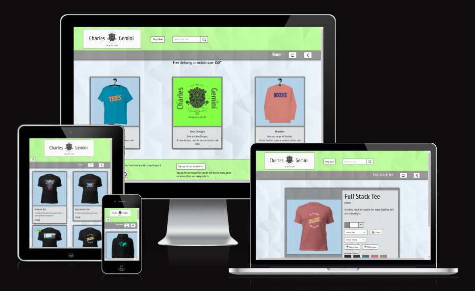
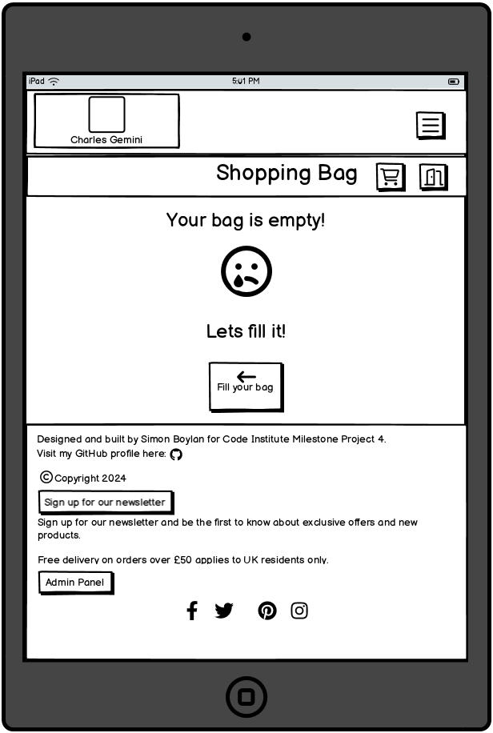
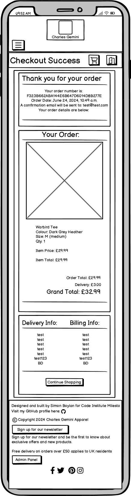
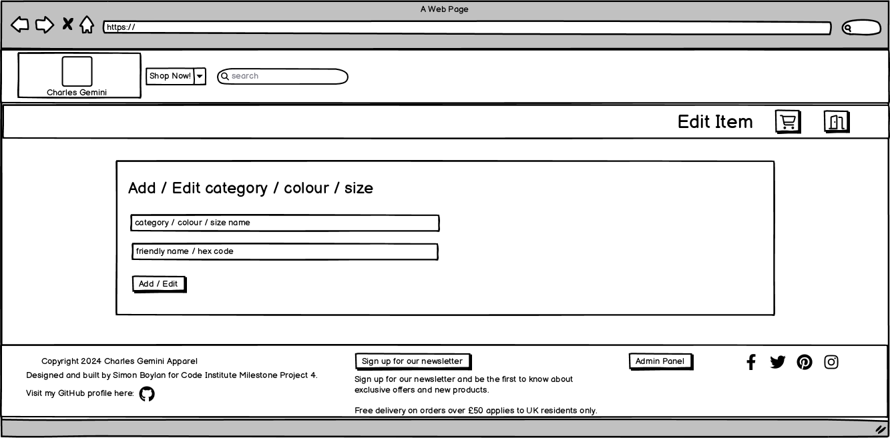
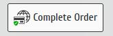
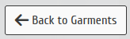

# [CHARLES GEMINI APPAREL](https://charles-gemini-apparel-6a23d410a6ee.herokuapp.com)

[](https://github.com/boderg/charles-gemini-apparel/commits/main)
[](https://github.com/boderg/charles-gemini-apparel/commits/main)
[](https://github.com/boderg/charles-gemini-apparel)

Charles Gemini Apparel is an online clothing retail store specialising in T-Shirts and Hooded Tops with custom design prints.

Charles Gemini Apparel was designed from the ground up by Simon Boylan for their Code Institute Milestome Project 4 and is a fully functioning site utilising the Stripe API for payments and GMail for sending confirmation emails.

Users of the Charles Gemini site are able to create user accounts where they can save their details and orders for future use and view their past orders.

Users are able to send messages to the admin of the Charles Gemini Apparel site through a contact form and users can also sign up with their email to receive newsletters.

*Below is a mockup of the deployed Charles Gemini Apparel site.*


source: [amiresponsive](https://ui.dev/amiresponsive?url=https://charles-gemini-apparel-6a23d410a6ee.herokuapp.com)

## UX

The process for the design of the Charles Gemini Apparel site started as a collection of user stories outlining the purpose and use for the site.

A rough idea was drawn up on paper that would outline the database structure for the Charles Gemini Apparel site.

Wireframes were then created using [Balsamiq](https://balsamiq.com/) to get a general feel for how the site would look.

The Charles Gemini Apparel site was then built using Django, Python, HTML, Bootstrap, CSS,and JavaScript.

### Colour Scheme

The colour scheme chosen for the site was one that would be comfortable on the eye but also inviting, pleasing to navigate and easy to read.

*Below is a colour palette of the colours chosen to fit the scheme.*


source: [coolors.co](https://coolors.co/93ff00-373737-fafafa-bcdcf5)

- `#93ff00` used for top navbar, footer and highlights.
- `#373737` used for text across the site on light backgrounds.
- `#fafafa` used for text on dark backgrounds and buttons.
- `#bcdcf5` used for main body background and image backgrounds.

Variations of these colours were worked to enable the softening of some of the colours with some opacity introduced for effect.

I've used CSS `:root` variables to easily update the global colour scheme, borders, shadows and font by changing only one value, instead of everywhere in the CSS file.

```CSS
:root {
    /** Fonts **/
    --main-font: 'Cuprum', sans-serif;

    /** Colours **/
    --body-background: rgb(188, 220, 245, 0.255);
    --body-background-translucent: rgba(188, 220, 245, 0.855);
    --background: rgb(250, 250, 250);
    --background-translucent: rgba(250, 250, 250, 0.75);
    --background-translucent-2: rgba(250, 250, 250, 0.5);
    --primary-colour: rgb(147, 255, 0);
    --primary-colour-translucent: rgba(147, 255, 0, 0.5);
    --primary-colour-translucent-2: rgba(147, 255, 0, 0.3);
    --primary-colour-translucent-3: rgba(147, 255, 0, 0.7);
    --secondary-colour: rgb(55, 55, 55);
    --secondary-colour-translucent: rgba(55, 55, 55, 0.5);
    --secondary-colour-translucent-2: rgba(55, 55, 55, 0.3);
    --warning-colour: rgb(249, 225, 84);
    --error-colour: rgb(200, 50, 50);
    --info-colour: rgb(64, 166, 206);
    --success-colour: rgb(147, 255, 0);

    /** Shadows **/
    --big-box-shadow: 1px 1px 10px rgb(55, 55, 55);
    --small-box-shadow: 1px 1px 5px rgb(55, 55, 55);
    --small-box-shadow-invert: 1px 1px 5px rgb(250, 250, 250);
    --big-inset-box-shadow: inset 1px 1px 5px rgb(55, 55, 55);
    --small-inset-box-shadow: inset 1px 1px 3px rgb(55, 55, 55);
    --text-shadow: 1px 1px 1px rgb(55, 55, 55);

    /** Borders **/
    --thin-border: 1px solid rgb(55, 55, 55);
    --border-radius: 3px;

    /** Other **/
    --transition-quick: all 0.2s ease-in-out;
}
```

### Typography

Only one font was chosen for the Charles Gemini Apparel site.

[Cuprum](https://fonts.google.com/?query=cuprum)

- This [Google](https://fonts.google.com/) font was chosen because it is the font used in the Logo, has a clean and modern style and scales nicely for the purpose of the site.

Two sources were used for the icons acros the Charles Gemini Apparel site.

[UXWing](https://uxwing.com/)

- These icons were used across the Charles Gemini Apparel site as they add a certain style that compliments the site along with a splash of colour. They are also available as SVG's which allowed for easy colour changing to match the site as all black icons were re-coloured to `#373737` to match the font and the magnifying glass re-coloured from blue to `#93ff00`.

[Font Awesome](https://fontawesome.com/)

- A few Font Awesome icons were used, namely for the plus and minus buttons and the left arrow on some back buttons. These were used as there were either no UXWing equivalents or the UXWing equivqlent did not match the site aesthetic.

## User Stories

### New Site Users

- As a new site user, I would like to be able to easily browse through all the t-shirts and hooded tops on the website, filtered by category, so that I can quickly find something that interests me.
- As a new site user, I would like to be able to search for t-shirts and hooded tops by keyword, so that I can see if you have what I'm looking for.
- As a new site user, I would like to see a detailed product page with clear, high-resolution images, so that I can make a more informed choice.
- As a new site user, I would like to be able to see the shirt or hoodie in different colors, so that I can ensure I choose the right one.
- As a new site user, I would like to be able to see a size chart with clear measurements, so that I can ensure a proper fit.
- As a new site user, I would like to be able to easily add items to my cart, so that I can securely purchase them.
- As a new site user, I would like to be able to clearly see the total cost of my order, including any taxes and shipping fees, so that I can be better informed before finalizing the purchase.

### Returning Site Users

- As a returning site user, I would like to be able to create an account, so that I can save my shipping information and track my order history.
- As a returning site user, I would like to be able to sign up for an email list to receive notifications, so that I can stay informed about new arrivals, promotions, and exclusive offers.
- As a returning site user, I would like to have a way to contact the site admin, so that I can get resolutions to issues I may have with my account.
- As a returning site user, I would like to contact the company, so that I can pass on suggestions or compliments.

### Site Admin

- As a site administrator, I should be able to have an easy site access method, so that I can add new t-shirt and hooded top designs to the website, including uploading high-quality images, descriptions, and pricing information.
- As a site administrator, I should be able to create and manage product categories and collections, so that I can organize the website for easy browsing.
- As a site administrator, I should be able to edit existing product information, such as descriptions, pricing, and images, so that I can keep the website content accurate and up-to-date.
- As a site administrator, I should be able to create and manage discounts, so that I can attract new customers.
- As a site administrator, I should be able to view and manage customer contacts, so that I can send the relevant newsletter or contact reply.

## Wireframes

To follow best practice, wireframes were developed for mobile, tablet, and desktop sizes.

<details>
<summary>Please click to view the Mobile wireframes for Charles Gemini Apparel</summary>
<br>

| Page | Mobile | Tablet | Desktop |
| --- | --- | --- | --- |
| Home |  |  |  |
| All Designs (*New Designs, Tees and Hoodies follow the same format.*) |  |  |  |
| Garment |  |  |  |
| Empty Bag (*404 and 500 pages use the same format.*) |  |  | |
| Bag |  |  |  |
| Checkout |  |  |  |
| Checkout Success |  |  |  |
| Profile |  |  |  |
| Admin Panel |  |  |   |
| Add Garment |  |  |  |
| Edit Garment (*Pre-populated version of add garment.*) |  |  |  |
| Selection Page (*The same format is used for all selection pages (garment, category, colour, size, contact and subscriber).*) |  |  |  |
| Add / Edit Item (*The same format is used for the category, colour, and size pages. Edit pages are pre-populated.*) |  |  |  |
| About Modal |  |  |  |
| Size Guide Modal |  |  |  |

</details>

## Features

### Existing Features

<details>
<summary>Please click to view the Mobile wireframes for Charles Gemini Apparel</summary>
<br>

| Page | Section | Feature | Description | Screenshot |
| --- | --- | --- | --- | --- |
| Home | | | | |
| | Top Nav| | | |
| | | Charles Gemini Apparel Logo | This is the brand log and also doubles as the Home page button. |  |
| | | Shop Now Button| This is the main navigation for the site. |  |
| | | Search Bar | This enables the user to search for products that are on the site. |  |
| | | Bottom Nav | | |
| | | Shopping Bag Icon | This is set up as a button and takes the user to the shopping bag. It also displays as a counter to inform of the quantity of items in the bag. |   |
| | | Login / Logout Icon | This is set up as a button and takes the user to the login or logout page dependant on whether the user is logged in or not. It is a dynamic button and switches between icons accordingly. |   |
| | Main | | | |
| | | Information Banner | This s a display tool that displays fixed messages and/or promotions, such as the free delivery message or the bag total. |   |
| | | Page Link Cards (Tees, New Designs and Hoodies) | These act as descriptors for the site and double as navigation to the Tees, New Designs and Hoodies pages respecively. the middle one is also a carousel rotating between its descriptor image and the brand logo. |  |
| | Footer | | | |
| | | Newsletter signup Button | This button navigates the user to a simple signup form where they can submit their email to receive email newsletters. |  |
| | | Admin Panel Button | This button navigates authorised users to the sites front end admin panel. This button is only visible to authorised logged in users. |  |
| | | GitHub Icon | This is set up as a button that opens the site creators GitHub repository on a separate page. |  |
| | | Social Media Icons | These icons are set up as buttons that open the associated social media sites on a new tab. These would ideally link to the social media pages of Charles Gemini Apparel. |  |
| All Designs, New Designs, Tees and Hoodies | | | | |
| | Main | | | |
| | |Garment Cards | These show a brief outline of the products along with price and and image. The image of the card is a link that navigates the user to the individual garment page. |  |
| Garment | | | | |
| | Main | | | |
| | | Garment Card | This displays all the information related to an individual garment, such as available sizes and colours, description, images and price. |  |
| | Garment Card Items | | | |
| | | Image Carousel | This displays the item in all its available colours and rotates through each colour in turn. The images can be stopped and rotated manually or left to rotate automatically. |  |
| | | Number Selector | This is set up to allow users to adjust the quantity of the product they want to purchase. It will not allow numbers outside of the range 1-99 to be used. the plus and minus buttons change to a darker grey and stop changing the number counter when they have reached the range limit. |  |
| | | Size Selector | This opens a dropdown list of selectable sizes and is to allow the user to select a size that suits them. |  |
| | | Size Guide Button | This is set to open a modal that contains an informative size guide for the user to make an informed choice about the sizing of the item that they are interested in. |  |
| | | Colour Selector | This opens a dropdown list of selectable colours the item is available in and is to allow the user to select a colour that suits them. |  |
| | | Add to Bag Button | This is to allow the user to add their current item selection to the shopping bag. |  |
| | | All Designs Button | This is to allow users to navigate away from the item page without using the browsers back arrow nd without saving the current selection if any has been made. this navigates to the all designs page. |  |
| | | Available Colours | This displays colour swatches of the colours that the item is available in. |  |
| Shopping Bag | | | | |
| | Bag Table | | | |
| | | Number Selector | This is set up to allow users to change the quantity of the selcted item. It will not allow numbers outside of the range 1-99 to be used. the plus and minus buttons change to a darker grey and stop changing the number counter when they have reached the range limit. |  |
| | | Size Selector | This opens a dropdown list of selectable sizes and is to allow the user to changethe selected size. |  |
| | | Colour Selector | This opens a dropdown list of selectable colours the item is available in and is to allow the user to change the selected colour. |  |
| | | Update Button | This updates the shopping bag with newly changed colour, size or quantity if the user has changed the selected items in the bag. |  |
| | | Remove Button | This allows the user to remove any item from the bag should they decide not to purchase or if they have added by mistake. |  |
| | | Continue Shopping Button | This allows the user to go back into the shop should they wish to browse and/or add other items prior to purchase. |  |
| | | Secure Checkout Button | This navigates the user to the payment window and puts the items from the bag into the checkout. |  |
| Checkout | | | | |
| | Order Summary | | | |
| | | Order Summary | This displays the order details to the user as a final sumamry before purchase. |  |
| | | Change Your Order Button | This allows the user to go back to the bag and make changes to the order before purchase. this is the final get out of the sale method before final purchase. |  |
| | Checkout Form | | | |
| | | Contact Details | this is where the user adds their contact details for the order. |  |
| | | Billing and Delivery Details | This is where the user adds their address for billing abd delivery purposes. |  |
| | | Create Account Link | This allows a non-registered user to create an account and save the details for quicker future purchases. |  |
| | | Login Link | This allows a registered user to login and retrieve their details for the purchase. |  |
| | | Card Payment Input | this allows the user to safely and securely use a credit / debit card for payment. |  |
| | | Complete Order Button | This processes the payment and is an irreversible process once clicked. The users card will then be charged with the billed amount. |  |
| Checkout Success | | | | |
| | Order Summary | | | |
| | | Thank You | This displays thank you message with order number, date of order and confirmation email notification. |  |
| | | Your Order | This displays a confirmation of the ordered products, prices and totals. |  |
| | | Delivery Info and Billing Info | This displays a confirmation of the address supplied for billing and delivery. |  |
| | | Continue Shopping Button | This allows the user to go back into the shop after a purchase and is worder to entice users to make further purchases. |  |
| My Profile | | | | |
| | Default Delivery Information | | | |
| | | Update Information Form and Button | This allows users to update their default delivery address when they have completed the form that the button is attached to. |  |
| | Order History | | | |
| | | Order Links | These are previous order numbers that have been formatted to act as links that open the associated order to allow users to view their previous orders. |  |
| Admin Panel | | | | |
| | Main | | | |
| | | Admin Panel | This panel houses front end access buttons for the database admin of the site. These buttons access the front end pages that allow the admin of the site to add, remove and edit items in the store. |  |
| Add and Edit Garment | | | | |
| | Main | | | |
| | | Add and Edit Garment Forms | These forms allow the site admin to add and edit garments. The add garment form opens empty while the edit garments form opens pre-populated with the selected garments details. |  |
| | | Add and Edit Garment Buttons | This submits the completed form to the database saving the new item or changed item and redirects the user to the items page. |   |
| | | Back to Garments Button | Returns the site admin to the all designs page without saving the changed or newly added garment.  |  |
| Add and Edit Category, Colour and Size | | | | |
| | Main | | | |
| | | Add and Edit Category Forms | These forms allow the site admin to add new or edit existing categories dependant on the selected. The edit form is a pre-populated version of the add form. |  |
| | | Add and Edit Colour Forms | These forms allow the site admin to add new or edit existing colours dependant on the selected. The edit form is a pre-populated version of the add form. |  |
| | | Add and Edit Size Forms | These forms allow the site admin to add new or edit existing sizes dependant on the selected. The edit form is a pre-populated version of the add form. |  |
| Garment, Category, Colour and Size Selection | | | | |
| | Main | | | |
| | | Listed Items from garments, categories, colour and sizes | This is a listed display of the items that are available to edit or delete and is accessed from one of the main edit buttons on the admin panel. |  |
| | | Contact List and Subscribers | This is the same as the listed item but does not have the edit function. |  |
| | | Edit Button | This allows the admin access to the edit form for item that is selected from the listed items. |     |
| | | Delete Button | This allows the admin access to the delete function for item that is selected from the listed items, contact list and subscribers. |       |
| | Modals | | | |
| | | Delete Modal | This accessed by the site admin when any of the admin delete buttons are clicked. This is to double confirm that the user wants to delete the item. |  |
| | | About Modal | This modal is accessed by clicking the about link in main site navigation and displays information about the brand. |  |
| | | Size Guide Modal | This is accessed by clicking any of the size guide links and displays sizing information about the products. |  |

</details>

### Future Features

Some future features that would be good to add to the site in the future:

Payment Methods

- Different types of payment methods e.g. Paypal, Klarna, etc.

Reveiw System

- An ability for users to review the products for others to make informed choices.

Rating system

- Similar to the review system but with a number or star system.

Email return system

- Somewhere admin and staff can return an email to the customer without using an external system.

Automated Newsletters

- Automate newsletters to send to the subscribers when new newsletters are created.

## Tools & Technologies Used

- [](https://tim.2bn.dev/markdown-builder) used to generate README and TESTING templates.
- [](https://git-scm.com) used for version control. (`git add`, `git commit`, `git push`)
- [](https://github.com) used for secure online code storage.
- [](https://code.visualstudio.com) used as my local IDE for development.
- [](https://en.wikipedia.org/wiki/HTML) used for the main site content.
- [](https://en.wikipedia.org/wiki/CSS) used for the main site design and layout.
- [](https://www.javascript.com) used for user interaction on the site.
- [](https://jquery.com) used for user interaction on the site.
- [](https://www.python.org) used as the back-end programming language.
- [](https://getbootstrap.com) used as the front-end CSS framework for modern responsiveness and pre-built components.
- [](https://www.djangoproject.com) used as the Python framework for the site.
- [](https://dbs.ci-dbs.net) used as the Postgres database from Code Institute.
- [](https://stripe.com) used for online secure payments of ecommerce products/services.
- [](https://mail.google.com) used for sending emails in my application.
- [](https://aws.amazon.com/s3) used for online static file storage.
- [](https://balsamiq.com/wireframes) used for creating wireframes.
- [](https://www.canva.com/p/canvawireframes) used for creating the brand logo and some garment designs.
- [](https://krita.org/en/) used for creating garment designs.
- [](https://inkscape.org/) used for re-colouring the uxwing svg icons.
- [](https://fontawesome.com) used for the icons.
- [](https://chat.openai.com) used to help debug, troubleshoot, and explain things.

## Database Design

Charles Gemini Apparel uses a relational database.

I have used `pygraphviz` and `django-extensions` to autogenerate an ERD.

The steps taken were as follows:

- In the terminal: `sudo apt update`
- then: `sudo apt-get install python3-dev graphviz libgraphviz-dev pkg-config`
- then type `Y` to proceed
- then: `pip3 install django-extensions pygraphviz`
- in my `settings.py` file, I added the following to my `INSTALLED_APPS`:

```python
INSTALLED_APPS = [
    ...
    'django_extensions',
    ...
]
```

- In the terminal again: `python3 manage.py graph_models -a -o erd.png`
- moved the new `erd.png` file into my `documentation/` folder
- removed `'django_extensions',` from my `INSTALLED_APPS`
- finally, in the terminal: `pip3 uninstall django-extensions pygraphviz -y`
- source: [medium.com](https://medium.com/@yathomasi1/1-using-django-extensions-to-visualize-the-database-diagram-in-django-application-c5fa7e710e16)

Below is a Database diagram that was built during the development of the Charles Gemini Apparel site using [dbdiagram.io](https://www.dbdiagram.io/),


source: [dbdiagram.io](https://www.dbdiagram.io/)

and a more comprehensive diagram created after deployment and testing using [pygraphviz](https://pygraphviz.github.io/documentation/stable/install.html).


source: [pygraphviz](https://pygraphviz.github.io/documentation/stable/install.html)

## Testing

>[!NOTE]
>
>For all testing, please refer to the [TESTING.md](TESTING.md) file.

## Deployment

The live deployed application can be found deployed on [Heroku](https://charles-gemini-apparel-6a23d410a6ee.herokuapp.com).

### PostgreSQL Database

This project uses a [Code Institute PostgreSQL Database](https://dbs.ci-dbs.net).

To obtain my own Postgres Database from Code Institute, I followed these steps:

- Signed-in to the CI LMS using my email address.
- An email was sent to me with my new Postgres Database.

> [!CAUTION]  
>
> - PostgreSQL databases by Code Institute are only available to CI Students.
> - You must acquire your own PostgreSQL database through some other method
> if you plan to clone/fork this repository.
> - Code Institute students are allowed a maximum of 8 databases.
> - Databases are subject to deletion after 18 months.

### Amazon AWS

This project uses [AWS](https://aws.amazon.com) to store media and static files online, due to the fact that Heroku doesn't persist this type of data.

Once you've created an AWS account and logged-in, follow these series of steps to get your project connected.
Make sure you're on the **AWS Management Console** page.

#### S3 Bucket

- Search for **S3**.
- Create a new bucket, give it a name (matching your Heroku app name), and choose the region closest to you.
- Uncheck **Block all public access**, and acknowledge that the bucket will be public (required for it to work on Heroku).
- From **Object Ownership**, make sure to have **ACLs enabled**, and **Bucket owner preferred** selected.
- From the **Properties** tab, turn on static website hosting, and type `index.html` and `error.html` in their respective fields, then click **Save**.
- From the **Permissions** tab, paste in the following CORS configuration:

    ```shell
    [
        {
            "AllowedHeaders": [
                "Authorization"
            ],
            "AllowedMethods": [
                "GET"
            ],
            "AllowedOrigins": [
                "*"
            ],
            "ExposeHeaders": []
        }
    ]
    ```

- Copy your **ARN** string.
- From the **Bucket Policy** tab, select the **Policy Generator** link, and use the following steps:
- Policy Type: **S3 Bucket Policy**
- Effect: **Allow**
- Principal: `*`
- Actions: **GetObject**
- Amazon Resource Name (ARN): **paste-your-ARN-here**
- Click **Add Statement**
- Click **Generate Policy**
- Copy the entire Policy, and paste it into the **Bucket Policy Editor**

    ```shell
    {
        "Id": "Policy1234567890",
        "Version": "2012-10-17",
        "Statement": [
            {
                "Sid": "Stmt1234567890",
                "Action": [
                    "s3:GetObject"
                ],
                "Effect": "Allow",
                "Resource": "arn:aws:s3:::your-bucket-name/*"
                "Principal": "*",
            }
        ]
    }
    ```

- Before you click "Save", add `/*` to the end of the Resource key in the Bucket Policy Editor (like above).
- Click **Save**.
- From the **Access Control List (ACL)** section, click "Edit" and enable **List** for **Everyone (public access)**, and accept the warning box.
  - If the edit button is disabled, you need to change the **Object Ownership** section above to **ACLs enabled** (mentioned above).

#### IAM

Back on the AWS Services Menu, search for and open **IAM** (Identity and Access Management).
Once on the IAM page, follow these steps:

- From **User Groups**, click **Create New Group**.
  - Suggested Name: `group-charles-gemini-apparel` (group + the project name)
- Tags are optional, but you must click it to get to the **review policy** page.
- From **User Groups**, select your newly created group, and go to the **Permissions** tab.
- Open the **Add Permissions** dropdown, and click **Attach Policies**.
- Select the policy, then click **Add Permissions** at the bottom when finished.
- From the **JSON** tab, select the **Import Managed Policy** link.
  - Search for **S3**, select the `AmazonS3FullAccess` policy, and then **Import**.
  - You'll need your ARN from the S3 Bucket copied again, which is pasted into "Resources" key on the Policy.

    ```shell
    {
        "Version": "2012-10-17",
        "Statement": [
            {
                "Effect": "Allow",
                "Action": "s3:*",
                "Resource": [
                    "arn:aws:s3:::your-bucket-name",
                    "arn:aws:s3:::your-bucket-name/*"
                ]
            }
        ]
    }
    ```

  - Click **Review Policy**.
  - Suggested Name: `policy-charles-gemini-apparel` (policy + the project name)
  - Provide a description:
  - "Access to S3 Bucket for charles-gemini-apparel static files."
  - Click **Create Policy**.
- From **User Groups**, click your "group-charles-gemini-apparel".
- Click **Attach Policy**.
- Search for the policy you've just created ("policy-charles-gemini-apparel") and select it, then **Attach Policy**.
- From **User Groups**, click **Add User**.
  - Suggested Name: `user-charles-gemini-apparel` (user + the project name)
- For "Select AWS Access Type", select **Programmatic Access**.
- Select the group to add your new user to: `group-charles-gemini-apparel`
- Tags are optional, but you must click it to get to the **review user** page.
- Click **Create User** once done.
- You should see a button to **Download .csv**, so click it to save a copy on your system.
  - **IMPORTANT**: once you pass this page, you cannot come back to download it again, so do it immediately!
  - This contains the user's **Access key ID** and **Secret access key**.
  - `AWS_ACCESS_KEY_ID` = **Access key ID**
  - `AWS_SECRET_ACCESS_KEY` = **Secret access key**

#### Final AWS Setup

- If Heroku Config Vars has `DISABLE_COLLECTSTATIC` still, this can be removed now, so that AWS will handle the static files.
- Back within **S3**, create a new folder called: `media`.
- Select any existing media images for your project to prepare them for being uploaded into the new folder.
- Under **Manage Public Permissions**, select **Grant public read access to this object(s)**.
- No further settings are required, so click **Upload**.

### Stripe API

This project uses [Stripe](https://stripe.com) to handle the ecommerce payments.

Once you've created a Stripe account and logged-in, follow these series of steps to get your project connected.

- From your Stripe dashboard, click to expand the "Get your test API keys".
- You'll have two keys here:
  - `STRIPE_PUBLIC_KEY` = Publishable Key (starts with **pk**)
  - `STRIPE_SECRET_KEY` = Secret Key (starts with **sk**)

As a backup, in case users prematurely close the purchase-order page during payment, we can include Stripe Webhooks.

- From your Stripe dashboard, click **Developers**, and select **Webhooks**.
- From there, click **Add Endpoint**.
  - `https://charles-gemini-apparel-6a23d410a6ee.herokuapp.com/checkout/wh/`
- Click **receive all events**.
- Click **Add Endpoint** to complete the process.
- You'll have a new key here:
  - `STRIPE_WH_SECRET` = Signing Secret (Wehbook) Key (starts with **wh**)

### Gmail API

This project uses [Gmail](https://mail.google.com) to handle sending emails to users for account verification and purchase order confirmations.

Once you've created a Gmail (Google) account and logged-in, follow these series of steps to get your project connected.

- Click on the **Account Settings** (cog icon) in the top-right corner of Gmail.
- Click on the **Accounts and Import** tab.
- Within the section called "Change account settings", click on the link for **Other Google Account settings**.
- From this new page, select **Security** on the left.
- Select **2-Step Verification** to turn it on. (verify your password and account)
- Once verified, select **Turn On** for 2FA.
- Navigate back to the **Security** page, and you'll see a new option called **App passwords**.
- This might prompt you once again to confirm your password and account.
- Select **Mail** for the app type.
- Select **Other (Custom name)** for the device type.
  - Any custom name, such as "Django" or charles-gemini-apparel
- You'll be provided with a 16-character password (API key).
  - Save this somewhere locally, as you cannot access this key again later!
  - `EMAIL_HOST_PASS` = user's 16-character API key
  - `EMAIL_HOST_USER` = user's own personal Gmail email address

### Heroku Deployment

This project uses [Heroku](https://www.heroku.com), a platform as a service (PaaS) that enables developers to build, run, and operate applications entirely in the cloud.

Deployment steps are as follows, after account setup:

- Select **New** in the top-right corner of your Heroku Dashboard, and select **Create new app** from the dropdown menu.
- Your app name must be unique, and then choose a region closest to you (EU or USA), and finally, select **Create App**.
- From the new app **Settings**, click **Reveal Config Vars**, and set your environment variables.

> [!IMPORTANT]  
> This is a sample only; you would replace the values with your own if cloning/forking my repository.

| Key | Value |
| --- | --- |
| `AWS_ACCESS_KEY_ID` | user's own value |
| `AWS_SECRET_ACCESS_KEY` | user's own value |
| `DATABASE_URL` | user's own value |
| `DISABLE_COLLECTSTATIC` | 1 (*this is temporary, and can be removed for the final deployment*) |
| `EMAIL_HOST_PASS` | user's own value |
| `EMAIL_HOST_USER` | user's own value |
| `SECRET_KEY` | user's own value |
| `STRIPE_PUBLIC_KEY` | user's own value |
| `STRIPE_SECRET_KEY` | user's own value |
| `STRIPE_WH_SECRET` | user's own value |
| `USE_AWS` | True |

Heroku needs three additional files in order to deploy properly.

- requirements.txt
- Procfile
- runtime.txt

You can install this project's **requirements** (where applicable) using:

- `pip3 install -r requirements.txt`

If you have your own packages that have been installed, then the requirements file needs updated using:

- `pip3 freeze --local > requirements.txt`

The **Procfile** can be created with the following command:

- `echo web: gunicorn app_name.wsgi > Procfile`
- *replace **app_name** with the name of your primary Django app name; the folder where settings.py is located*

The **runtime.txt** file needs to know which Python version you're using:

1. type: `python3 --version` in the terminal.
2. in the **runtime.txt** file, add your Python version:

- `python-3.9.19`

For Heroku deployment, follow these steps to connect your own GitHub repository to the newly created app:

Either:

- Select **Automatic Deployment** from the Heroku app.

Or:

- In the Terminal/CLI, connect to Heroku using this command: `heroku login -i`
- Set the remote for Heroku: `heroku git:remote -a app_name` (replace *app_name* with your app name)
- After performing the standard Git `add`, `commit`, and `push` to GitHub, you can now type:
  - `git push heroku main`

The project should now be connected and deployed to Heroku!

### Local Deployment

This project can be cloned or forked in order to make a local copy on your own system.

For either method, you will need to install any applicable packages found within the *requirements.txt* file.

- `pip3 install -r requirements.txt`.

You will need to create a new file called `env.py` at the root-level,
and include the same environment variables listed above from the Heroku deployment steps.

> [!IMPORTANT]  
> This is a sample only; you would replace the values with your own if cloning/forking my repository.

Sample `env.py` file:

```python
import os

os.environ.setdefault("AWS_ACCESS_KEY_ID", "user's own value")
os.environ.setdefault("AWS_SECRET_ACCESS_KEY", "user's own value")
os.environ.setdefault("DATABASE_URL", "user's own value")
os.environ.setdefault("EMAIL_HOST_PASS", "user's own value")
os.environ.setdefault("EMAIL_HOST_USER", "user's own value")
os.environ.setdefault("SECRET_KEY", "user's own value")
os.environ.setdefault("STRIPE_PUBLIC_KEY", "user's own value")
os.environ.setdefault("STRIPE_SECRET_KEY", "user's own value")
os.environ.setdefault("STRIPE_WH_SECRET", "user's own value")

# local environment only (do not include these in production/deployment!)
os.environ.setdefault("DEBUG", "True")
```

Once the project is cloned or forked, in order to run it locally, you'll need to follow these steps:

- Start the Django app: `python3 manage.py runserver`
- Stop the app once it's loaded: `CTRL+C` or `⌘+C` (Mac)
- Make any necessary migrations: `python3 manage.py makemigrations`
- Migrate the data to the database: `python3 manage.py migrate`
- Create a superuser: `python3 manage.py createsuperuser`
- Load fixtures (if applicable): `python3 manage.py loaddata file-name.json` (repeat for each file)
- Everything should be ready now, so run the Django app again: `python3 manage.py runserver`

If you'd like to backup your database models, use the following command for each model you'd like to create a fixture for:

- `python3 manage.py dumpdata your-model > your-model.json`
- *repeat this action for each model you wish to backup*

#### Cloning

You can clone the repository by following these steps:

1. Go to the [GitHub repository](https://github.com/boderg/charles-gemini-apparel)
2. Locate the Code button above the list of files and click it
3. Select if you prefer to clone using HTTPS, SSH, or GitHub CLI and click the copy button to copy the URL to your clipboard
4. Open Git Bash or Terminal
5. Change the current working directory to the one where you want the cloned directory
6. In your IDE Terminal, type the following command to clone my repository:\
  `git clone https://github.com/boderg/charles-gemini-apparel.git`
7. Press Enter to create your local clone.

Alternatively, if using Gitpod, you can click below to create your own workspace using this repository.

[](https://gitpod.io/#https://github.com/boderg/charles-gemini-apparel)

Please note that in order to directly open the project in Gitpod, you need to have the browser extension installed.
A tutorial on how to do that can be found [here](https://www.gitpod.io/docs/configure/user-settings/browser-extension).

#### Forking

By forking the GitHub Repository, we make a copy of the original repository on our GitHub account to view and/or make changes without affecting the original owner's repository.
You can fork this repository by using the following steps:

1. Log in to GitHub and locate the [GitHub Repository](https://github.com/boderg/charles-gemini-apparel)
2. At the top of the Repository (not top of page) just above the "Settings" Button on the menu, locate the "Fork" Button.
3. Once clicked, you should now have a copy of the original repository in your own GitHub account!

### Local VS Deployment

There are no discernable differences visually between the local development Charles Gemin Apparel environment and the Heroku deployed Charles Gemini Apparel site.

There is one small speed difference between the local development Charles Gemini Apparel environment and the Heroku deployed Charles Gemini Apparel site.
The Heroku deployed site is marginally slower due to static files being loaded from AWS and the eco dynos cause the site to go to sleep if inactive for a while.

## Credits

> [!NOTE]
>
> All brand logos and clothing designs were created by myself using the tools listed in the tools and technologies section and in the content and media sections below.

Along side the aforementioned tools and technologies used in building the Charles Gemini Apparel site, I would like to acknowledge all applicable content that has aided the creation of Charles Gemini Apparel as outlined in the sections below.

### Content

| Source | Location | Notes |
| --- | --- | --- |
| [Markdown Builder](https://tim.2bn.dev/markdown-builder) | README and TESTING | tool to help generate the Markdown files |
| Dee Mc [YouTube](https://www.youtube.com/@IonaFrisbee) | Settings and allauth | tutorials for general better understanding of django |
| Codemy.com Django Wednesdays [You Tube](https://www.youtube.com/@Codemycom) | Apps | tutorials for a general better understanding of django |
| [Canva](https://www.canva.com/) | Logo and Garment designs | tool for designing logos and imagery |
| [NightCafe](https://creator.nightcafe.studio/) | Garment designs | tool for creating ai artwork |
| [Dopely Colors](https://colors.dopely.top/color-name-finder) | Colour Swatches | tool to find the hex codes for the garment colours |

### Media

| Source | Location | Type | Notes |
| --- | --- | --- | --- |
| [Freepik](https://www.freepik.com/free-vector/white-abstract-wallpaper_12066076.htm#fromView=search&page=28&position=41&uuid=2aafca47-2271-4abc-a30d-0359acbb5278) | Main Background | Image | abstract image to give background texture |
| [Printful](https://www.printful.com/uk) | Garments and size guide | Images and text content | for the clothing mockups and the size guide images and info |
| [UXWing](https://uxwing.com/) | Site wide | Icons | for the svg icons |

### Acknowledgements

- I would like to thank my Code Institute mentor, [Chris Quinn](https://github.com/10xOXR) for their support throughout the development of this project.
- I would like to thank my previous Code Institute mentor, [Tim Nelson](https://github.com/TravelTimN) for their encouragement to continue my journey after my one project course had finished.
- I would like to thank [Code Institute](https://codeinstitute.net) for giving me the opportunity to complete the 4P course.
- I would like to thank my [Code Institute](https://codeinstitute.net) facilitator [Amy Richardson](https://github.com/amylour) for their advice and support.
- I would like to thank the [Code Institute Slack community](https://code-institute-room.slack.com) for the moral support and general information that helps with my studies.
- I would like to thank my fellow classmates for the invaluable sharing of knowledge.
- I would like to thank my family, for their support and understanding, for believing in me, and allowing me to make this transition into software development.
