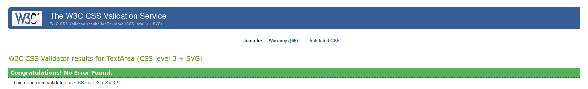
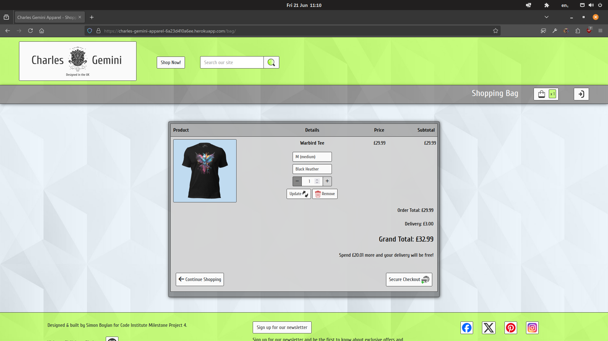
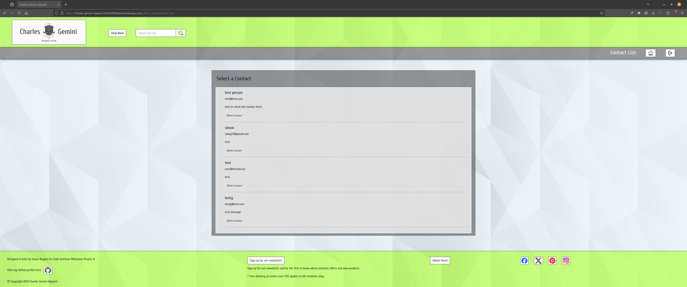

# Testing

Return back to the [README.md](README.md) file.

## Code Validation

### HTML

I have used the recommended [HTML W3C Validator](https://validator.w3.org) to validate all of my HTML files.

>[!NOTE]
>
>*HTML Validation was performed in two ways:*
>
>1. From the live site the page source was inspected, copied and pasted into the validator.
>2. From the live site the url was copied and pasted into the validator.
>
>These two methods were chosen for HTML validation due to the django content in the site being incompatible with the validator.
>
>*Pages marked with '#' had one or both of the following two warnings / errors noted and filtered out of the testing results for the following reasons:*
>
>- One filtered out warning for *'no header'* - this is because of django templating to access the dynamic page titles *{{ page_title }}*
>- One filtered out error for *'bad value for attribute action'* in the delete form - this is because of django templating to access urls - specifically *{{ delete_url }}*

Click to view the HTML validation results for Charles Gemini Apparel

| Directory | File | Screenshot Errors | Screenshot Method 1 | Screenshot Method 2 | Notes / Fixes |
| --- | --- | --- | --- | --- | --- |
| admin_panel | add_category.html | No errors to show. |  |  | Passed! '#' |
| admin_panel | add_colour.html | No errors to show. |  |  | Passed! '#' |
| admin_panel | add_garment.html |  |  |  | *34 x 'Duplicate attribute' errors for `class="form-control"`* - this was due to the form-control class being added as an extra attribute to the form. Extra attribute was removed from forms.py to remove errors. 
 *'Bad value `submit` for attribute type on element `a`' error* - this was due to the attribute not being removed from a link when it was converted from a button. Removed attribute `submit` from `a`. |
| admin_panel | add_size.html | No errors to show. |  |  | Passed! '#' |
| admin_panel | admin_panel.html | No errors to show. |  |  | Passed! |
| admin_panel | contact_list.html | No errors to show. |  |  | Passed! '#' |
| admin_panel | edit_category.html | No errors to show. |  |  | Passed! '#' |
| admin_panel | edit_colour.html | No errors to show. |  |  | Passed! '#' |
| admin_panel | edit_garment.html | No errors to show. |  |  | Passed! '#' |
| admin_panel | edit_size.html | No errors to show. |  |  | Passed! '#' |
| admin_panel | list_categories.html | No errors to show. |  |  | Passed!'*' |
| admin_panel | list_colours.html | No errors to show. |  |  | Passed!'#' |
| admin_panel | list_garments.html |  |  |  | Passed!'#' |
| admin_panel | list_sizes.html | No errors to show. |  |  | Passed!'#' |
| admin_panel | newsletter_list.html | No errors to show. |  |  | Passed!'#' |
| apparel | all_garments.html |  |  |  | *'Heading `h3` cannot be a child of another heading' error* - this was due to a heading tag in the page title on the base template conflicting with a heading tag in the block element on the page. Removed heading tag from base template. The following warnings and errors were all related - *2 x 'Empty heading', 'Stray end tag `h3`'.* 
 *2 x `aria-labelldby` attribute must point to an element in the same document' error* - Re-named `aria-labelledby` attriute. |
| apparel | garment.html |  |  |  | *2 x 'Stray start tag', 1 x 'Stray end tag' and 'Text not allowed in element `select` in this context'* - due to an icon being erroneously added to a `select` element. Removed all offending articles. 
 *'Bad value `submit` for attribute type on element `a`' error* - this was due to an attribute not being removed from a link when it was converted from a button. Removed attribute `submit` from `a`. |
| bag | bag.html |  |  |  | *2 x 'Trailing slash `/` on void elements has no effect and interacts badly with unquoted attribute values'* - Removed trailing slash `/`. 
 *5 x 'Duplicate ID' and 'The first occurence of ID was here'* - this is due to the way django is set to create ID's for the select dropdown options. |
| checkout | checkout.html |  |  |  | '#' and *'Empty heading'* - the empty heading is caused by the loading spinner having no text. |
| checkout | checkout_success.html | No errors to show. |  |  | Passed! |
| contact | contact.html | No errors to show. |  |  | Passed! |
| contact | contact_success.html | No errors to show. |  |  | Passed! |
| contact | newsletter_signup.html | No errors to show. |  |  | Passed! |
| contact | newsletter_success.html | No errors to show. |  |  | Passed! |
| home | index.html |  |  |  | *'Element `h3` not allowed as child of elemet `ul` in this context'* - Added `li` element around `h3`. 
 *'No space between attributes'* - Added a space between `image` and `alt` attributes. 
 *2 x 'The element `button` must not appear as a descendant of the `a` element'* - Moved the link inside of the carousel to wrap the image instead of the whole carousel. 
 *'The `type` attribute is unnecessary for JavaScript resources'* - Removed the `type` attribute. 
 *2 x `aria-labelldby` attribute must point to an element in the same document' error* - Re-named `aria-labelledby` attriute. |
| profiles | profile.html |  |  |  | *'Stray end tag `thead`'* - Re-located `</thead>` back to end of table head. 
 *'The `type` attribute is unnecessary for JavaScript resources'* - Removed the type attribute. |
| all_auth | login.html | No errors to show. |  |  | Passed! '#' |
| all_auth | logout.html | No errors to show. |  |  | Passed! '#' |
| all_auth | signup.html | No errors to show. |  |  | Passed! '#' |

### CSS

I have used the recommended [CSS Jigsaw Validator](https://jigsaw.w3.org/css-validator) to validate all of my CSS files.

>[!NOTE]
>
>All files passed the CSS Jigsaw validation tests.

Click to view the CSS validation results for Charles Gemini Apparel

| Directory | File | Screenshot | Notes |
| --- | --- | --- | --- |
| admin_panel | add_garment.css |  | Passed! |
| admin_panel | admin_panel.css |  | Passed! |
| admin_panel | edit_garment.css |  | Passed! |
| admin_panel | list_garments.css |  | Passed! |
| apparel | garment.css |  | Passed! |
| bag | bag.css |  | Passed! |
| checkout | checkout.css |  | Passed! |
| checkout | checkout_success.css |  | Passed! |
| contact | contact.css |  | Passed! |
| profiles | profile.css |  | Passed! |
| static | base.css |  | Passed! |
| static | error_pages.css |  | Passed! |
| static | login.css |  | Passed! |
| static | modal.css |  | Passed! |
| static | error.css |  | Passed! |
| static | info.css |  | Passed! |
| static | success.css |  | Passed! |
| static | warning.css |  | Passed! |

### JavaScript

I have used the recommended [JShint Validator](https://jshint.com) to validate all of my JS files.

>[!NOTE]
>
>All files passed the JShint validation tests.

Click to view the JavaScript validation results for Charles Gemini Apparel

| Directory | File | Screenshot | Notes |
| --- | --- | --- | --- |
| admin_panel | delete_modal.js |  | Passed! |
| checkout | stripe_elements.js |  | Passed! |
| contact | success_timer.js |  | Passed! |
| profiles | countryfield.js |  | Passed! |
| static | quantity.js |  | Passed! |

### Python

I have used the recommended [PEP8 CI Python Linter](https://pep8ci.herokuapp.com) to validate all of my Python files.

>[!NOTE]
>
>All files passed the PEP8 CI Python Linter validation tests.

Click to view the Python validation results for Charles Gemini Apparel

| Directory | File | CI URL | Screenshot | Notes |
| --- | --- | --- | --- | --- |
| admin_panel | admin.py | [PEP8 CI](https://pep8ci.herokuapp.com/https://raw.githubusercontent.com/boderg/charles-gemini-apparel/main/admin_panel/admin.py) | *File not used* | *Nothing to note* |
| admin_panel | forms.py | [PEP8 CI](https://pep8ci.herokuapp.com/https://raw.githubusercontent.com/boderg/charles-gemini-apparel/main/admin_panel/forms.py) |  | Passed! |
| admin_panel | models.py | [PEP8 CI](https://pep8ci.herokuapp.com/https://raw.githubusercontent.com/boderg/charles-gemini-apparel/main/admin_panel/models.py) | *File not used* | *Nothing to note* |
| admin_panel | urls.py | [PEP8 CI](https://pep8ci.herokuapp.com/https://raw.githubusercontent.com/boderg/charles-gemini-apparel/main/admin_panel/urls.py) |  | Passed! |
| admin_panel | views.py | [PEP8 CI](https://pep8ci.herokuapp.com/https://raw.githubusercontent.com/boderg/charles-gemini-apparel/main/admin_panel/views.py) |  | Passed! |
| apparel | admin.py | [PEP8 CI](https://pep8ci.herokuapp.com/https://raw.githubusercontent.com/boderg/charles-gemini-apparel/main/apparel/admin.py) |  | Passed! |
| apparel | forms.py | [PEP8 CI](https://pep8ci.herokuapp.com/https://raw.githubusercontent.com/boderg/charles-gemini-apparel/main/apparel/forms.py) |  | Passed! |
| apparel | models.py | [PEP8 CI](https://pep8ci.herokuapp.com/https://raw.githubusercontent.com/boderg/charles-gemini-apparel/main/apparel/models.py) |  | Passed! |
| apparel | urls.py | [PEP8 CI](https://pep8ci.herokuapp.com/https://raw.githubusercontent.com/boderg/charles-gemini-apparel/main/apparel/urls.py) |  | Passed! |
| apparel | views.py | [PEP8 CI](https://pep8ci.herokuapp.com/https://raw.githubusercontent.com/boderg/charles-gemini-apparel/main/apparel/views.py) |  | Passed! |
| bag | admin.py | [PEP8 CI](https://pep8ci.herokuapp.com/https://raw.githubusercontent.com/boderg/charles-gemini-apparel/main/bag/admin.py) | *File not used* | *Nothing to note* |
| bag | contexts.py | [PEP8 CI](https://pep8ci.herokuapp.com/https://raw.githubusercontent.com/boderg/charles-gemini-apparel/main/bag/contexts.py) |  | Passed! |
| bag | models.py | [PEP8 CI](https://pep8ci.herokuapp.com/https://raw.githubusercontent.com/boderg/charles-gemini-apparel/main/bag/models.py) | *File not used* | *Nothing to note* |
| bag | bag_tools.py | [PEP8 CI](https://pep8ci.herokuapp.com/https://raw.githubusercontent.com/boderg/charles-gemini-apparel/main/bag/templatetags/bag_tools.py) |  | Passed! |
| bag | urls.py | [PEP8 CI](https://pep8ci.herokuapp.com/https://raw.githubusercontent.com/boderg/charles-gemini-apparel/main/bag/urls.py) |  | Passed! |
| bag | views.py | [PEP8 CI](https://pep8ci.herokuapp.com/https://raw.githubusercontent.com/boderg/charles-gemini-apparel/main/bag/views.py) |  | Passed! |
| checkout | admin.py | [PEP8 CI](https://pep8ci.herokuapp.com/https://raw.githubusercontent.com/boderg/charles-gemini-apparel/main/checkout/admin.py) |  | Passed! |
| checkout | forms.py | [PEP8 CI](https://pep8ci.herokuapp.com/https://raw.githubusercontent.com/boderg/charles-gemini-apparel/main/checkout/forms.py) |  | Passed! |
| checkout | models.py | [PEP8 CI](https://pep8ci.herokuapp.com/https://raw.githubusercontent.com/boderg/charles-gemini-apparel/main/checkout/models.py) |  | Passed! |
| checkout | signals.py | [PEP8 CI](https://pep8ci.herokuapp.com/https://raw.githubusercontent.com/boderg/charles-gemini-apparel/main/checkout/signals.py) |  | Passed! |
| checkout | urls.py | [PEP8 CI](https://pep8ci.herokuapp.com/https://raw.githubusercontent.com/boderg/charles-gemini-apparel/main/checkout/urls.py) |  | Passed! |
| checkout | views.py | [PEP8 CI](https://pep8ci.herokuapp.com/https://raw.githubusercontent.com/boderg/charles-gemini-apparel/main/checkout/views.py) |  | Passed! |
| checkout | webhook_handler.py | [PEP8 CI](https://pep8ci.herokuapp.com/https://raw.githubusercontent.com/boderg/charles-gemini-apparel/main/checkout/webhook_handler.py) |  | Passed! |
| checkout | webhooks.py | [PEP8 CI](https://pep8ci.herokuapp.com/https://raw.githubusercontent.com/boderg/charles-gemini-apparel/main/checkout/webhooks.py) |  | Passed! |
| contact | admin.py | [PEP8 CI](https://pep8ci.herokuapp.com/https://raw.githubusercontent.com/boderg/charles-gemini-apparel/main/contact/admin.py) |  | Passed! |
| contact | forms.py | [PEP8 CI](https://pep8ci.herokuapp.com/https://raw.githubusercontent.com/boderg/charles-gemini-apparel/main/contact/forms.py) |  | Passed! |
| contact | models.py | [PEP8 CI](https://pep8ci.herokuapp.com/https://raw.githubusercontent.com/boderg/charles-gemini-apparel/main/contact/models.py) |  | Passed! |
| contact | urls.py | [PEP8 CI](https://pep8ci.herokuapp.com/https://raw.githubusercontent.com/boderg/charles-gemini-apparel/main/contact/urls.py) |  | Passed! |
| contact | views.py | [PEP8 CI](https://pep8ci.herokuapp.com/https://raw.githubusercontent.com/boderg/charles-gemini-apparel/main/contact/views.py) |  | Passed! |
|  | custom_storages.py | [PEP8 CI](https://pep8ci.herokuapp.com/https://raw.githubusercontent.com/boderg/charles-gemini-apparel/main/custom_storages.py) |  | Passed! |
| home | admin.py | [PEP8 CI](https://pep8ci.herokuapp.com/https://raw.githubusercontent.com/boderg/charles-gemini-apparel/main/home/admin.py) | *File not used* | *Nothing to Note* |
| home | models.py | [PEP8 CI](https://pep8ci.herokuapp.com/https://raw.githubusercontent.com/boderg/charles-gemini-apparel/main/home/models.py) | *File not used* | *Nothing to Note* |
| home | urls.py | [PEP8 CI](https://pep8ci.herokuapp.com/https://raw.githubusercontent.com/boderg/charles-gemini-apparel/main/home/urls.py) |  | Passed! |
| home | views.py | [PEP8 CI](https://pep8ci.herokuapp.com/https://raw.githubusercontent.com/boderg/charles-gemini-apparel/main/home/views.py) |  | Passed! |
| main | settings.py | [PEP8 CI](https://pep8ci.herokuapp.com/https://raw.githubusercontent.com/boderg/charles-gemini-apparel/main/main/settings.py) |  | Passed! |
| main | urls.py | [PEP8 CI](https://pep8ci.herokuapp.com/https://raw.githubusercontent.com/boderg/charles-gemini-apparel/main/main/urls.py) |  | Passed! |
|  | manage.py | [PEP8 CI](https://pep8ci.herokuapp.com/https://raw.githubusercontent.com/boderg/charles-gemini-apparel/main/manage.py) |  | Passed! |
| profiles | admin.py | [PEP8 CI](https://pep8ci.herokuapp.com/https://raw.githubusercontent.com/boderg/charles-gemini-apparel/main/profiles/admin.py) | *File not used* | *Nothing to note* |
| profiles | forms.py | [PEP8 CI](https://pep8ci.herokuapp.com/https://raw.githubusercontent.com/boderg/charles-gemini-apparel/main/profiles/forms.py) |  | Passed! |
| profiles | models.py | [PEP8 CI](https://pep8ci.herokuapp.com/https://raw.githubusercontent.com/boderg/charles-gemini-apparel/main/profiles/models.py) |  | Passed! |
| profiles | urls.py | [PEP8 CI](https://pep8ci.herokuapp.com/https://raw.githubusercontent.com/boderg/charles-gemini-apparel/main/profiles/urls.py) |  | Passed! |
| profiles | views.py | [PEP8 CI](https://pep8ci.herokuapp.com/https://raw.githubusercontent.com/boderg/charles-gemini-apparel/main/profiles/views.py) |  | Passed! |

## Browser Compatibility

I've tested my deployed project on the following three browsers to check for compatibility issues:

- Chrome
- Firefox
- Safari

I decided to use these three browsers as they use different platforms independant of each other.

> [!NOTE]
>
>Charles Gemini Apparel behaved as expected on all browsers tested.

Click to view the Browser compatibility testing results for Charles Gemini Apparel

| Page | Chrome | Firefox | Safari |
| --- | --- | --- | --- |
| Home |  |  |  |
| All Designs |  |  |  |
| Garment |  |  |  |
| Bag |  |  |  |
| Checkout |  |  |  |
| Checkout Success |  |  |  |
| Profile |  |  |  |
| Admin Panel |  |  |  |
| Add, List, Edit Garment |  |  |  |
| Add, List, Edit Colour |  |  |  |
| Add, List, Edit Size |  |  |  |
| Add, List, Edit Category |  |  |  |
| Contact, Contact List, Contact Success |  |  |  |
| Newsletter Signup, Newsletter List, Newsletter Success |  |  |  |
| About, Size Guide, Delete Modals |  |  |  |
| Login, Logout, Signup |  |  |  |

## Responsiveness

I've tested the Charles Gemini Apparel deployed project on multiple devices to check for responsiveness issues.

> [!NOTE]
>
>Charles Gemini Apparel behaved as expected on all responsive tests.

Click to view the Responsiveness testing results for Charles Gemini Apparel

| Page | Mobile (DevTools) | Tablet (DevTools) | 1080p Laptop | 1080p Monitor | 1440p UW Monitor | Samsung Galaxy S10+ |
| --- | --- | --- | --- | --- | --- | --- |
| Home | /home.png) | /home.png) |  |  |  |  |
| All Designs | /all_designs.png) | /all_designs.png) |  |  |  |  |
| Garment | /garment.png) | /garment.png) |  |  |  |  |
| Bag | /bag.png) | /bag.png) |  |  |  |  |
| Checkout | /checkout.png) | /checkout.png) |  |  |  |  |
| Checkout Success | /checkout_success.png) | /checkout_success.png) |  |  |  |  |
| Profile | /profile.png) | /profile.png) |  |  |  |  |
| Admin Panel | /admin_panel.png) | /admin_panel.png) |  |  |  |  |
| Add, List, Edit Garment | /add_garment.png) | /list_garments.png) |  |  |  |  |
| Add, List, Edit Colour | /add_colour.png) | /list_colours.png) |  |  |  |  |
| Add, List, Edit Size | /add_size.png) | /list_sizes.png) |  |  |  |  |
| Add, List, Edit Category | /add_category.png) | /list_categories.png) |  |  |  |  |
| Contact, Contact List, Contact Success | /contact.png) | /contact_list.png) |  |  |  |  |
| Newsletter, Newsletter List, Newsletter Success | /newsletter_signup.png) | /newsletter_list.png) |  |  |  |  |
| About, Size Guide, Delete Modals | /about_modal.png) | /size_guide_modal.png) |  |  |  |  |
| Login, Logout, Signup | /login.png) | /logout.png) |  |  |  |  |

