# Testing

Return back to the [README.md](README.md) file.

## Code Validation

### HTML

I have used the recommended [HTML W3C Validator](https://validator.w3.org) to validate all of my HTML files.

>[!NOTE]
>
>*HTML Validation was performed in two ways:*
>
>1. From the live site the page source was inspected, copied and pasted into the validator.
>2. From the live site the url was copied and pasted into the validator.
>
>These two methods were chosen for HTML validation due to the django content in the site being incompatible with the validator.
>
>*Pages marked with '#' had one or both of the following two warnings / errors noted and filtered out of the testing results for the following reasons:*
>
>- One filtered out warning for *'no Top Nav Bar'* - this is because of django templating to access the dynamic page titles *{{ page_title }}*
>- One filtered out error for *'bad value for attribute action'* in the delete form - this is because of django templating to access urls - specifically *{{ delete_url }}*

Click to view the HTML validation results for Charles Gemini Apparel

 

| Directory | File | Screenshot Errors | Screenshot Method 1 | Screenshot Method 2 | Notes / Fixes |
| --- | --- | --- | --- | --- | --- |
| admin_panel | add_category.html | No errors to show. |  |  | Passed! '#' |
| admin_panel | add_colour.html | No errors to show. |  |  | Passed! '#' |
| admin_panel | add_garment.html |  |  |  | *34 x 'Duplicate attribute' errors for `class="form-control"`* - this was due to the form-control class being added as an extra attribute to the form. Extra attribute was removed from forms.py to remove errors. 
 *'Bad value `submit` for attribute type on element `a`' error* - this was due to the attribute not being removed from a link when it was converted from a button. Removed attribute `submit` from `a`. |
| admin_panel | add_size.html | No errors to show. |  |  | Passed! '#' |
| admin_panel | admin_panel.html | No errors to show. |  | 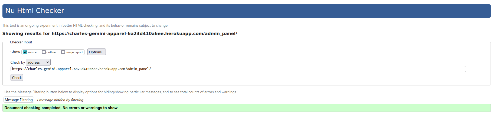 | Passed! |
| admin_panel | contact_list.html | No errors to show. |  |  | Passed! '#' |
| admin_panel | edit_category.html | No errors to show. |  |  | Passed! '#' |
| admin_panel | edit_colour.html | No errors to show. |  |  | Passed! '#' |
| admin_panel | edit_garment.html | No errors to show. |  |  | Passed! '#' |
| admin_panel | edit_size.html | No errors to show. |  |  | Passed! '#' |
| admin_panel | list_categories.html | No errors to show. |  |  | Passed!'*' |
| admin_panel | list_colours.html | No errors to show. |  | 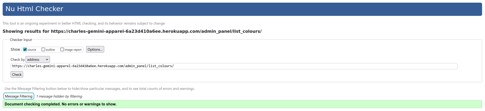 | Passed!'#' |
| admin_panel | list_garments.html |  |  |  | Passed!'#' |
| admin_panel | list_sizes.html | No errors to show. |  |  | Passed!'#' |
| admin_panel | newsletter_list.html | No errors to show. |  |  | Passed!'#' |
| apparel | all_garments.html |  |  |  | *'Heading `h3` cannot be a child of another heading' error* - this was due to a heading tag in the page title on the base template conflicting with a heading tag in the block element on the page. Removed heading tag from base template. The following warnings and errors were all related - *2 x 'Empty heading', 'Stray end tag `h3`'.* 
 *2 x `aria-labelldby` attribute must point to an element in the same document' error* - Re-named `aria-labelledby` attriute. |
| apparel | garment.html |  | 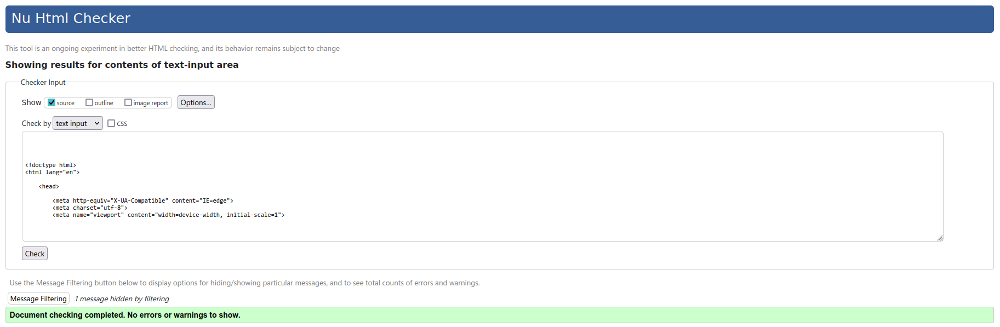 |  | *2 x 'Stray start tag', 1 x 'Stray end tag' and 'Text not allowed in element `select` in this context'* - due to an icon being erroneously added to a `select` element. Removed all offending articles. 
 *'Bad value `submit` for attribute type on element `a`' error* - this was due to an attribute not being removed from a link when it was converted from a button. Removed attribute `submit` from `a`. |
| bag | bag.html |  |  | 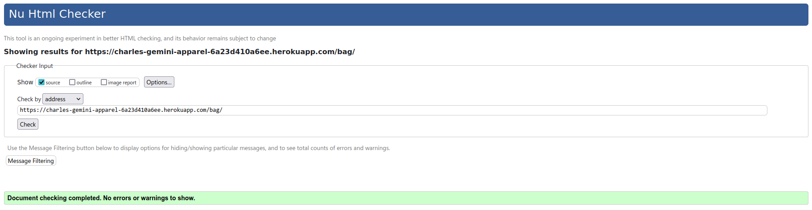 | *2 x 'Trailing slash `/` on void elements has no effect and interacts badly with unquoted attribute values'* - Removed trailing slash `/`. 
 *5 x 'Duplicate ID' and 'The first occurence of ID was here'* - this is due to the way django is set to create ID's for the select dropdown options. |
| checkout | checkout.html |  |  |  | '#' and *'Empty heading'* - the empty heading is caused by the loading spinner having no text. |
| checkout | checkout_success.html | No errors to show. |  |  | Passed! |
| contact | contact.html | No errors to show. |  |  | Passed! |
| contact | contact_success.html | No errors to show. |  |  | Passed! |
| contact | newsletter_signup.html | No errors to show. |  |  | Passed! |
| contact | newsletter_success.html | No errors to show. |  |  | Passed! |
| home | index.html |  |  |  | *'Element `h3` not allowed as child of elemet `ul` in this context'* - Added `li` element around `h3`. 
 *'No space between attributes'* - Added a space between `image` and `alt` attributes. 
 *2 x 'The element `button` must not appear as a descendant of the `a` element'* - Moved the link inside of the carousel to wrap the image instead of the whole carousel. 
 *'The `type` attribute is unnecessary for JavaScript resources'* - Removed the `type` attribute. 
 *2 x `aria-labelldby` attribute must point to an element in the same document' error* - Re-named `aria-labelledby` attriute. |
| profiles | profile.html |  |  |  | *'Stray end tag `thead`'* - Re-located `</thead>` back to end of table head. 
 *'The `type` attribute is unnecessary for JavaScript resources'* - Removed the type attribute. |
| all_auth | login.html | No errors to show. |  |  | Passed! '#' |
| all_auth | logout.html | No errors to show. |  |  | Passed! '#' |
| all_auth | signup.html | No errors to show. |  |  | Passed! '#' |

### CSS

I have used the recommended [CSS Jigsaw Validator](https://jigsaw.w3.org/css-validator) to validate all of my CSS files.

>[!NOTE]
>
>All files passed the CSS Jigsaw validation tests.

Click to view the CSS validation results for Charles Gemini Apparel

 

| Directory | File | Screenshot | Notes |
| --- | --- | --- | --- |
| admin_panel | add_garment.css |  | Passed! |
| admin_panel | admin_panel.css |  | Passed! |
| admin_panel | edit_garment.css |  | Passed! |
| admin_panel | list_garments.css |  | Passed! |
| apparel | garment.css |  | Passed! |
| bag | bag.css |  | Passed! |
| checkout | checkout.css |  | Passed! |
| checkout | checkout_success.css |  | Passed! |
| contact | contact.css |  | Passed! |
| profiles | profile.css |  | Passed! |
| static | base.css |  | Passed! |
| static | error_pages.css |  | Passed! |
| static | login.css |  | Passed! |
| static | modal.css |  | Passed! |
| static | error.css |  | Passed! |
| static | info.css |  | Passed! |
| static | success.css |  | Passed! |
| static | warning.css |  | Passed! |

### JavaScript

I have used the recommended [JShint Validator](https://jshint.com) to validate all of my JS files.

>[!NOTE]
>
>All files passed the JShint validation tests.

Click to view the JavaScript validation results for Charles Gemini Apparel

 

| Directory | File | Screenshot | Notes |
| --- | --- | --- | --- |
| admin_panel | delete_modal.js |  | Passed! |
| checkout | stripe_elements.js |  | Passed! |
| contact | success_timer.js |  | Passed! |
| profiles | countryfield.js |  | Passed! |
| static | quantity.js |  | Passed! |

### Python

I have used the recommended [PEP8 CI Python Linter](https://pep8ci.herokuapp.com) to validate all of my Python files.

>[!NOTE]
>
>All files passed the PEP8 CI Python Linter validation tests.

Click to view the Python validation results for Charles Gemini Apparel

 

| Directory | File | CI URL | Screenshot | Notes |
| --- | --- | --- | --- | --- |
| admin_panel | admin.py | [PEP8 CI](https://pep8ci.herokuapp.com/https://raw.githubusercontent.com/boderg/charles-gemini-apparel/main/admin_panel/admin.py) | *File not used* | *Nothing to note* |
| admin_panel | forms.py | [PEP8 CI](https://pep8ci.herokuapp.com/https://raw.githubusercontent.com/boderg/charles-gemini-apparel/main/admin_panel/forms.py) |  | Passed! |
| admin_panel | models.py | [PEP8 CI](https://pep8ci.herokuapp.com/https://raw.githubusercontent.com/boderg/charles-gemini-apparel/main/admin_panel/models.py) | *File not used* | *Nothing to note* |
| admin_panel | urls.py | [PEP8 CI](https://pep8ci.herokuapp.com/https://raw.githubusercontent.com/boderg/charles-gemini-apparel/main/admin_panel/urls.py) | 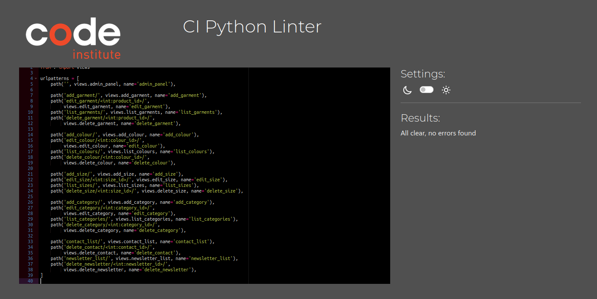 | Passed! |
| admin_panel | views.py | [PEP8 CI](https://pep8ci.herokuapp.com/https://raw.githubusercontent.com/boderg/charles-gemini-apparel/main/admin_panel/views.py) |  | Passed! |
| apparel | admin.py | [PEP8 CI](https://pep8ci.herokuapp.com/https://raw.githubusercontent.com/boderg/charles-gemini-apparel/main/apparel/admin.py) |  | Passed! |
| apparel | forms.py | [PEP8 CI](https://pep8ci.herokuapp.com/https://raw.githubusercontent.com/boderg/charles-gemini-apparel/main/apparel/forms.py) |  | Passed! |
| apparel | models.py | [PEP8 CI](https://pep8ci.herokuapp.com/https://raw.githubusercontent.com/boderg/charles-gemini-apparel/main/apparel/models.py) |  | Passed! |
| apparel | urls.py | [PEP8 CI](https://pep8ci.herokuapp.com/https://raw.githubusercontent.com/boderg/charles-gemini-apparel/main/apparel/urls.py) |  | Passed! |
| apparel | views.py | [PEP8 CI](https://pep8ci.herokuapp.com/https://raw.githubusercontent.com/boderg/charles-gemini-apparel/main/apparel/views.py) |  | Passed! |
| bag | admin.py | [PEP8 CI](https://pep8ci.herokuapp.com/https://raw.githubusercontent.com/boderg/charles-gemini-apparel/main/bag/admin.py) | *File not used* | *Nothing to note* |
| bag | contexts.py | [PEP8 CI](https://pep8ci.herokuapp.com/https://raw.githubusercontent.com/boderg/charles-gemini-apparel/main/bag/contexts.py) |  | Passed! |
| bag | models.py | [PEP8 CI](https://pep8ci.herokuapp.com/https://raw.githubusercontent.com/boderg/charles-gemini-apparel/main/bag/models.py) | *File not used* | *Nothing to note* |
| bag | bag_tools.py | [PEP8 CI](https://pep8ci.herokuapp.com/https://raw.githubusercontent.com/boderg/charles-gemini-apparel/main/bag/templatetags/bag_tools.py) | 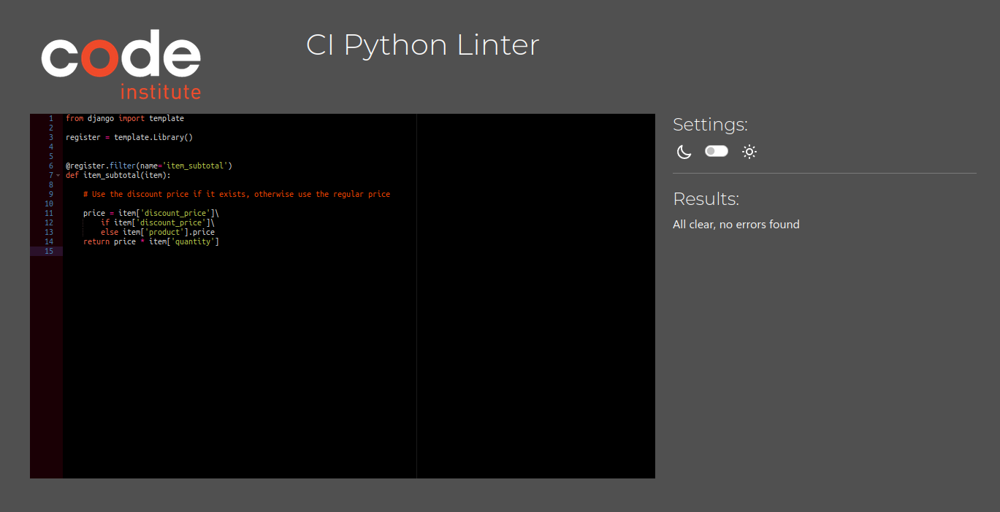 | Passed! |
| bag | urls.py | [PEP8 CI](https://pep8ci.herokuapp.com/https://raw.githubusercontent.com/boderg/charles-gemini-apparel/main/bag/urls.py) |  | Passed! |
| bag | views.py | [PEP8 CI](https://pep8ci.herokuapp.com/https://raw.githubusercontent.com/boderg/charles-gemini-apparel/main/bag/views.py) |  | Passed! |
| checkout | admin.py | [PEP8 CI](https://pep8ci.herokuapp.com/https://raw.githubusercontent.com/boderg/charles-gemini-apparel/main/checkout/admin.py) |  | Passed! |
| checkout | forms.py | [PEP8 CI](https://pep8ci.herokuapp.com/https://raw.githubusercontent.com/boderg/charles-gemini-apparel/main/checkout/forms.py) |  | Passed! |
| checkout | models.py | [PEP8 CI](https://pep8ci.herokuapp.com/https://raw.githubusercontent.com/boderg/charles-gemini-apparel/main/checkout/models.py) |  | Passed! |
| checkout | signals.py | [PEP8 CI](https://pep8ci.herokuapp.com/https://raw.githubusercontent.com/boderg/charles-gemini-apparel/main/checkout/signals.py) |  | Passed! |
| checkout | urls.py | [PEP8 CI](https://pep8ci.herokuapp.com/https://raw.githubusercontent.com/boderg/charles-gemini-apparel/main/checkout/urls.py) |  | Passed! |
| checkout | views.py | [PEP8 CI](https://pep8ci.herokuapp.com/https://raw.githubusercontent.com/boderg/charles-gemini-apparel/main/checkout/views.py) |  | Passed! |
| checkout | webhook_handler.py | [PEP8 CI](https://pep8ci.herokuapp.com/https://raw.githubusercontent.com/boderg/charles-gemini-apparel/main/checkout/webhook_handler.py) |  | Passed! |
| checkout | webhooks.py | [PEP8 CI](https://pep8ci.herokuapp.com/https://raw.githubusercontent.com/boderg/charles-gemini-apparel/main/checkout/webhooks.py) |  | Passed! |
| contact | admin.py | [PEP8 CI](https://pep8ci.herokuapp.com/https://raw.githubusercontent.com/boderg/charles-gemini-apparel/main/contact/admin.py) |  | Passed! |
| contact | forms.py | [PEP8 CI](https://pep8ci.herokuapp.com/https://raw.githubusercontent.com/boderg/charles-gemini-apparel/main/contact/forms.py) |  | Passed! |
| contact | models.py | [PEP8 CI](https://pep8ci.herokuapp.com/https://raw.githubusercontent.com/boderg/charles-gemini-apparel/main/contact/models.py) |  | Passed! |
| contact | urls.py | [PEP8 CI](https://pep8ci.herokuapp.com/https://raw.githubusercontent.com/boderg/charles-gemini-apparel/main/contact/urls.py) |  | Passed! |
| contact | views.py | [PEP8 CI](https://pep8ci.herokuapp.com/https://raw.githubusercontent.com/boderg/charles-gemini-apparel/main/contact/views.py) |  | Passed! |
|  | custom_storages.py | [PEP8 CI](https://pep8ci.herokuapp.com/https://raw.githubusercontent.com/boderg/charles-gemini-apparel/main/custom_storages.py) |  | Passed! |
| home | admin.py | [PEP8 CI](https://pep8ci.herokuapp.com/https://raw.githubusercontent.com/boderg/charles-gemini-apparel/main/home/admin.py) | *File not used* | *Nothing to Note* |
| home | models.py | [PEP8 CI](https://pep8ci.herokuapp.com/https://raw.githubusercontent.com/boderg/charles-gemini-apparel/main/home/models.py) | *File not used* | *Nothing to Note* |
| home | urls.py | [PEP8 CI](https://pep8ci.herokuapp.com/https://raw.githubusercontent.com/boderg/charles-gemini-apparel/main/home/urls.py) |  | Passed! |
| home | views.py | [PEP8 CI](https://pep8ci.herokuapp.com/https://raw.githubusercontent.com/boderg/charles-gemini-apparel/main/home/views.py) |  | Passed! |
| main | settings.py | [PEP8 CI](https://pep8ci.herokuapp.com/https://raw.githubusercontent.com/boderg/charles-gemini-apparel/main/main/settings.py) |  | Passed! |
| main | urls.py | [PEP8 CI](https://pep8ci.herokuapp.com/https://raw.githubusercontent.com/boderg/charles-gemini-apparel/main/main/urls.py) |  | Passed! |
|  | manage.py | [PEP8 CI](https://pep8ci.herokuapp.com/https://raw.githubusercontent.com/boderg/charles-gemini-apparel/main/manage.py) |  | Passed! |
| profiles | admin.py | [PEP8 CI](https://pep8ci.herokuapp.com/https://raw.githubusercontent.com/boderg/charles-gemini-apparel/main/profiles/admin.py) | *File not used* | *Nothing to note* |
| profiles | forms.py | [PEP8 CI](https://pep8ci.herokuapp.com/https://raw.githubusercontent.com/boderg/charles-gemini-apparel/main/profiles/forms.py) |  | Passed! |
| profiles | models.py | [PEP8 CI](https://pep8ci.herokuapp.com/https://raw.githubusercontent.com/boderg/charles-gemini-apparel/main/profiles/models.py) |  | Passed! |
| profiles | urls.py | [PEP8 CI](https://pep8ci.herokuapp.com/https://raw.githubusercontent.com/boderg/charles-gemini-apparel/main/profiles/urls.py) |  | Passed! |
| profiles | views.py | [PEP8 CI](https://pep8ci.herokuapp.com/https://raw.githubusercontent.com/boderg/charles-gemini-apparel/main/profiles/views.py) |  | Passed! |

## Browser Compatibility

I've tested my deployed project on the following three browsers to check for compatibility issues:

- [Chrome](https://www.google.com/chrome)
- [Firefox](https://www.mozilla.org/en-GB/firefox/new/)
- [Safari](https://www.apple.com/uk/safari/)

I decided to use these three browsers as they use different platforms independant of each other.

> [!NOTE]
>
>Charles Gemini Apparel behaved as expected on all browsers tested.

Click to view the Browser compatibility testing results for Charles Gemini Apparel

 

| Page | Chrome | Firefox | Safari |
| --- | --- | --- | --- |
| Home |  |  |  |
| All Designs |  |  |  |
| Garment |  |  |  |
| Bag |  |  |  |
| Checkout |  |  |  |
| Checkout Success |  |  |  |
| Profile |  |  |  |
| Admin Panel |  |  |  |
| Add, List, Edit Garment |  |  |  |
| Add, List, Edit Colour |  |  |  |
| Add, List, Edit Size |  |  |  |
| Add, List, Edit Category |  |  |  |
| Contact, Contact List, Contact Success |  |  |  |
| Newsletter Signup, Newsletter List, Newsletter Success |  |  |  |
| About, Size Guide, Delete Modals |  |  |  |
| Login, Logout, Signup |  |  |  |

## Responsiveness

I've tested the Charles Gemini Apparel deployed project on multiple devices to check for responsiveness issues.

> [!NOTE]
>
>Charles Gemini Apparel behaved as expected on all responsive tests.

Click to view the Responsiveness testing results for Charles Gemini Apparel

 

| Page | Mobile (DevTools) | Tablet (DevTools) | 1080p Laptop | 1080p Monitor | 1440p UW Monitor | Samsung Galaxy S10+ |
| --- | --- | --- | --- | --- | --- | --- |
| Home | /home.png) | /home.png) |  |  |  |  |
| All Designs | /all_designs.png) | /all_designs.png) |  |  |  | 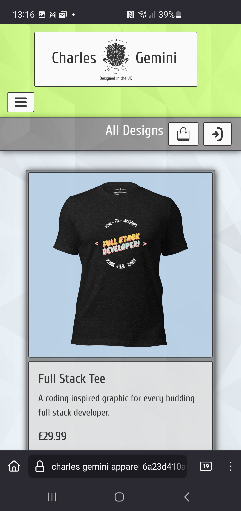 |
| Garment | /garment.png) | /garment.png) |  |  |  |  |
| Bag | /bag.png) | /bag.png) |  |  |  |  |
| Checkout | /checkout.png) | /checkout.png) |  |  |  |  |
| Checkout Success | /checkout_success.png) | /checkout_success.png) |  |  |  |  |
| Profile | /profile.png) | /profile.png) |  |  |  |  |
| Admin Panel | /admin_panel.png) | /admin_panel.png) |  |  |  |  |
| Add, List, Edit Garment | /add_garment.png) | /list_garments.png) |  |  |  |  |
| Add, List, Edit Colour | /add_colour.png) | /list_colours.png) |  |  |  |  |
| Add, List, Edit Size | /add_size.png) | /list_sizes.png) |  |  |  |  |
| Add, List, Edit Category | /add_category.png) | /list_categories.png) |  |  |  |  |
| Contact, Contact List, Contact Success | /contact.png) | /contact_list.png) |  |  |  |  |
| Newsletter, Newsletter List, Newsletter Success | /newsletter_signup.png) | /newsletter_list.png) |  |  |  |  |
| About, Size Guide, Delete Modals | /about_modal.png) | /size_guide_modal.png) |  |  |  |  |
| Login, Logout, Signup | /login.png) | /logout.png) |  |  |  |  |

## Lighthouse Audit

I've tested the Charles Gemini Apparel deployed project using the [Lighthouse Audit tool](https://developer.chrome.com/docs/lighthouse/overview) to check for any major issues.

>[!NOTE]
>
>*General notes for lighthouse audit results*
>
>- Mobile results have a significant drop in performance over desktop results.
>- The highest drops in performance on desktop appear to be in relation to the number of garment images on each page.
>- These drops in performace could potentially be the result of a combination of image size and fetch time from the AWS S3 storage. 
>- All garment images have been saved in webp format but could potentially be shrunk to smaller sizes to aid storage capacities and fetch times.
>- Accessibility could be improved in some areas.
>- Best practices and SEO are the same across the site with SEO needing some improvement.

Click to view the Lighthouse Audit test results for Charles Gemini Apparel

 

| Page | Mobile | Desktop |
| --- | --- | --- |
| Home |  | 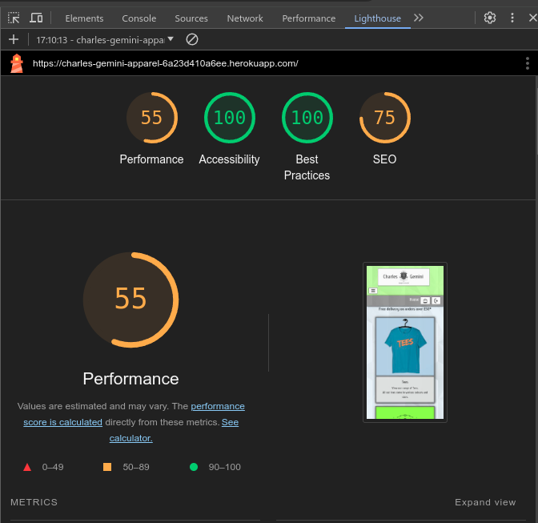 |
| All Designs |  |  |
| New Designs |  |  |
| Tees |  |  |
| Hoodies |  |  |
| Garment |  |  |
| Bag |  |  |
| Checkout |  |  |
| Checkout Success |  |  |
| Profile |  |  |
| Admin Panel |  |  |
| Add Garment |  |  |
| List Garment |  |  |
| Edit Garment |  |  |
| Add Colour |  |  |
| List Colour |  |  |
| Edit Colour |  |  |
| Add Size |  |  |
| List Size |  |  |
| Edit Size |  |  |
| Add Category |  |  |
| List Category |  |  |
| Edit Category |  |  |
| Contact | 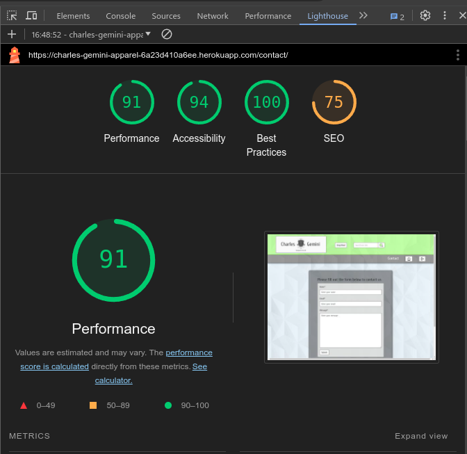 |  |
| Contact List |  |  |
| Newsletter |  |  |
| Newsletter List |  |  |

## Wave Compatibility

The Charles Gemini Apparel deployed site was tested using the [Wave Compatibility tester](https://wave.webaim.org/), however the Wave tester could only test pages that were not signed into as it does not have access to secured pages.
The following results are from the non secured pages of the site.

>[!NOTE]
>
>The errors noted by the tester are due to django templating.

Click to view the Wave accesibility test results for Charles Gemini Apparel

 

| Page | Summary Screenshot | Contrast Screenshot |
| --- | --- | --- |
| Home |  |  |
| All Designs |  |  |
| New Designs |  |  |
| Tees |  |  |
| Hoodies |  |  |
| Garment |  |  |
| Bag |  | 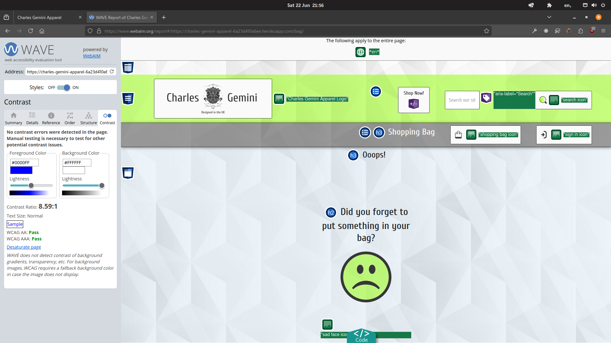 |
| Contact |  |  |
| Newsletter | 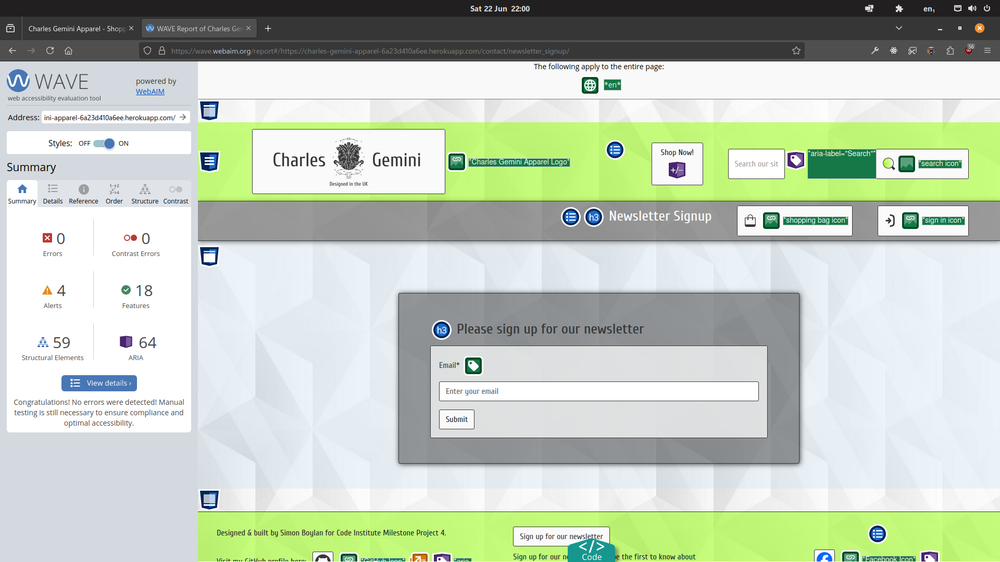 | 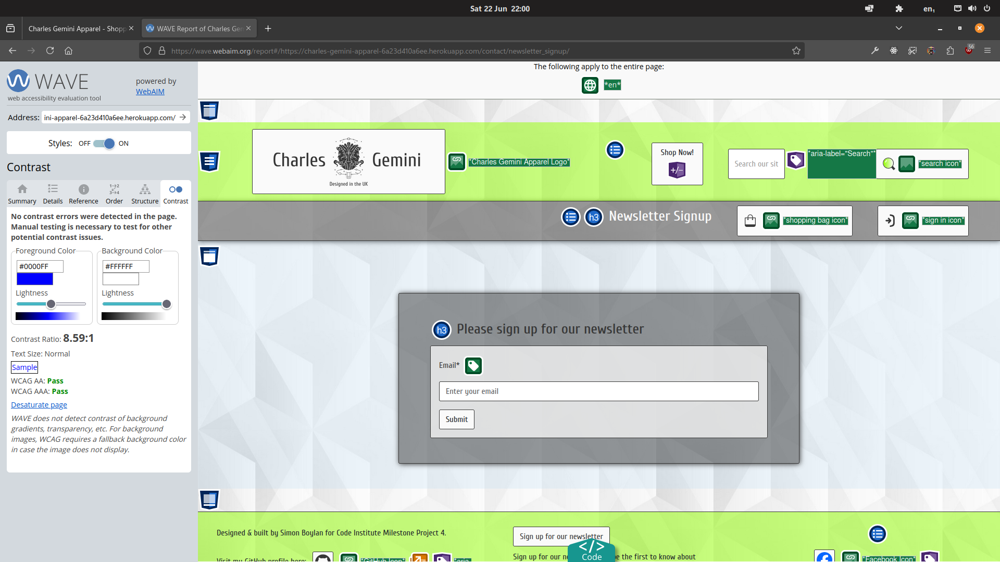 |

## Defensive Programming

Defensive programming was manually tested for Charles Gemini Apparel with the below user acceptance testing:

Click to view the user acceptance test results for Charles Gemini Apparel

 

| Page | Section | Expectation | Test | Result | Fix | Screenshot |
| --- | --- | --- | --- | --- | --- | --- |
| Home | | | | | | |
| | Top Nav Bar | The *Charles Gemini Logo* is expected to act as a home button when clicked and return the user to the *Home* page. | Tested the feature by navigating away from the home page and clicking the *Charles Gemini Logo*. | The feature behaved as expected, and retuned the user to the *Home* page. | Test concluded and passed. |  |
| | Top Nav Bar | The *Shop Now!* button is expected to open a dropdown with navigation links to the site. | Tested the feature by clicking on the *Shop Now!* button and selecting each of the navigation links in the dropdown in turn. | The feature behaved as expected, and opened a dropdown with the site navigation links. Each link clicked opened the corresponding page or modal. | Test concluded and passed. |   |
| | Top Nav Bar | The *Search box and button* is expected to accept a criteria of terms based on the garment details and category names to search the site and return results based on that criteria. | Tested the feature by entering keywords and clicking the *Search box and button*. | The feature behaved as expected, and return results based on the search criteria or returns an error message informing the user that no garment was found. | Test concluded and passed. |  |
| | Bottom Nav Bar | The *Bag* button is expected to open the shopping bag page and display an item counter if any items are in the bag. | Tested the feature by clicking the *Bag* button when no items were in the bag and also by putting an item in the bag and clicking on the *Bag* button. | The feature behaved as expected, and returned the empty shopping bag page when no items were in the bag and returned the shopping bag with items when items were in the bag along with an item counter in the *Bag* button. | Test concluded and passed. |  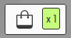 |
| | Bottom Nav Bar | The *Login / Logout* button is expected to open the *Login or Logout* page and change state to a *Login or Logout* button dependant on the users login status. | Tested the feature by clicking the *Login / Logout* button and logging in and out of the site. | The feature behaved as expected, and change state dependant on login status. | Test concluded and passed. | 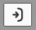  |
| | Main Body | The *Page links* are expected to open the associated page when the user clixks on the image.  | Test the feature by clicking on the links in turn. | The feature behaved as expected, and open the associated page connected with that link. | Tes cocluded and passed. | 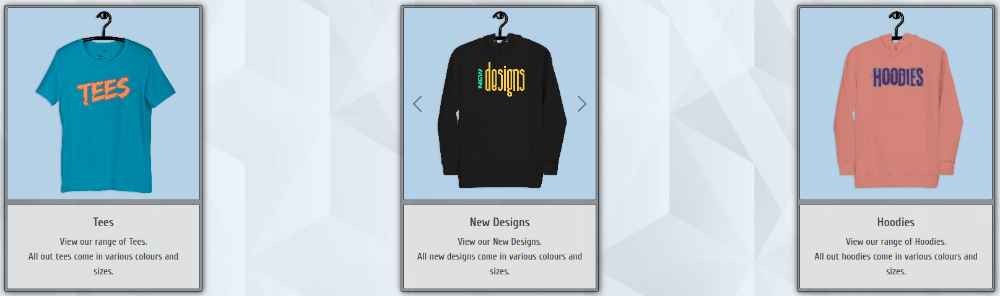 |
| | Main Body | The home page *Carousel* is expected to display a rotation of different images that can be stopped and manually rotated if required. | Tested the feature by hovering the mouse on the *Carousel* and by clicking the *Carousel Next and Previous* buttons. | The feature behaved as expected, and the *Carousel* stopped when the mouse was hovered on the images. The images were also able to be rotated manually using the *Carousel Next and Previous* buttons.  | Test concluded and passed. |  |
| | Footer | The *Newsletter Signup* button is expected to open a page where the user can input and submit their email address to a mailing list. | Tested the feature by clicking on the *Newsletter Signup* button. | The feature behaved as expected, and opened the newsletter signup page. | Test concluded and passed.|  |
| | Footer | The *Admin Panel* button is expected to open a page where the site *Administrator / Superuser* can administer various aspects of the site without having to log in to the backend server side. the button is also expected to be only visible when the superuser is logged in to the site. | Tested the feature by clicking on the *Admin Panel* button while logged in as the superuser. | The feature behaved as expected, and opened the Admin Panel page page. | Test concluded and passed.|  |
| | Footer | The *GitHub* icon is expected to act as a button that opens the site creators *GitHub* profile in a new browser tab. | Tested the feature by clicking on the *GitHub* icon. | The feature behaved as expected, and opened the site creators *GitHub* profile in a new browser tab. | Test concluded and passed. |  |
| | Footer | The *Social Media* icons are expected to act as buttons that open the associated social media site in a new browser tab. | Tested the feature by clicking on the *Social Media* icons in turn. | The feature behaved as expected, and opened the associated social media pages in new browser tabs. | Test concluded and passed. |  |
| All Designs, New Designs, Tees and Hoodies | | | | | | |
| | Garment Cards | The *Garment* images are expected to to act as buttons / links to open the page associated with the garment that is clicked. | Tested the feature by clicking on each *Garment* image in turn. | The feature behaved as expected, and opened the associated garment page. | Test concluded and passed. |  |
| Garment | | | | | | |
| | Garment Card | The garment page *Carousel* is expected to display a rotation of the same image in different colours that can be stopped and manually rotated if required. | Tested the feature by hovering the mouse on the *Carousel* and by clicking the *Carousel Next and Previous* buttons. | The feature behaved as expected, and the *Carousel* stopped when the mouse was hovered on the images. The images were also able to be rotated manually using the *Carousel Next and Previous* buttons.  | Test concluded and passed. |  |
| | Garment Card | The *Number Selector* is expected to increment or decrement the number of items that the user wants to add to the bag. It is also expected to not exceed the range of 1-99 inclusive. | Tested the feature by selecting different quantities and adding the item to the bag. Quantites outside the range were also tested by manual entry. | The feature behaved as expected, and incremented or decremented the quantity as desired and did not allow numbers outside the range to be used. | Test concluded and passed. |  |
| | Garment Card | The *Size Selector* dropdown is expected to open a dropdown selection of sizes that the user can select for the garment. | Tested the feature by clicking the *Size Selector* button and selecting a size then adding the item to the bag. | The feature behaved as expected, and the size selected was added to the bag with the item and quantity. | Test concluded and passed. |  |
| | Garment Card | The *Colour Selector* dropdown is expected to open a dropdown selection of colours that the user can select for the garment. | Tested the feature by clicking the *Colour Selector* button and selecting a colour then adding the item to the bag. | The feature behaved as expected, and the colour selected was added to the bag with the item and quantity. | Test concluded and passed. |  |
| | Garment Card | The *Size Guide* button is expected to open the size guide modal. | Tested the feature by clicking the *Size Guide* button. | The feature behaved as expected, and opened the size guide modal. | Test concluded and passed. |  |
| | Garment Card | The *Add to bag* button is expected to add the selected item and put it in the shopping bag then redirect the user to the all designs page. | Tested the feature by clicking the *Add to bag* button. | The feature behaved as expected, and added the selected item to the bag then redirected the user to the all designs page. | Test concluded and passed. |  |
| | Garment Card | The *All Designs* button is expected to open the all designs page without saving the selected item. | Tested the feature by clicking the *All Designs* button. | The feature behaved as expected, and opened the all designs page without saving the item selection. | Test concluded and passed. |  |
| Shopping Bag | | | | | | |
| | Bag Table | The *Size Selector* dropdown is expected to open a dropdown selection of sizes that the user can select for the garment. | Tested the feature by clicking the *Size Selector* button and selecting a size then adding the item to the bag. | The feature behaved as expected, and the size selected was added to the bag with the item and quantity. | Test concluded and passed. |  |
| | Bag Table | The *Colour Selector* dropdown is expected to open a dropdown selection of colours that the user can select for the garment. | Tested the feature by clicking the *Colour Selector* button and selecting a colour then adding the item to the bag. | The feature behaved as expected, and the colour selected was added to the bag with the item and quantity. | Test concluded and passed. |  |
| | Bag Table | The *Number Selector* is expected to increment or decrement the number of items that the user wants to add to the bag. It is also expected to not exceed the range of 1-99 inclusive. | Tested the feature by selecting different quantities and adding the item to the bag. Quantites outside the range were also tested by manual entry. | The feature behaved as expected, and incremented or decremented the quantity as desired and did not allow numbers outside the range to be used. | Test concluded and passed. |  |
| | Bag Table | The *Update* button is expected to update the selected item in the bag after the user has changed their size, colour and quantity selections. | Tested the feature by clicking the *Update* button. | The feature behaved as expected, and updated the item in the bag and reflected the updates in the adjusted shopping bag price structure. | Test concluded and passed. | 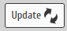 |
| | Bag Table | The *Remove* button is expected to remove the selected item fromthe shopping bag. | Tested the feature by clicking the *Remove* button. | The feature behaved as expected, and removed the item selection from the shopping bag and redirected the user to the empty bag page if no other items were present in the bag. | Test concluded and passed. |  |
| | Bag Table | The *Continue Shopping* button is expected to return the user to the all designs page while saving the items already in the shopping bag. | Tested the feature by clicking the *Continue Shopping* button. | The feature behaved as expected, and returned the user to the all designs page saving the items already in the shopping bag. | Test concluded and passed. |  |
| | Bag Table | The *Secure Checkout* button is expected to add the items of the bag to the checkout and open the checkout page so the user can purchase the items. | Tested the feature by clicking the *Secure Checkout* button. | The feature behaved as expected, and opened the checkout page with all the selected items that were added to the bag. | Test concluded and passed. |  |
| Checkout | | | | | | |
| | Order Summary | The *Change Your Order* button is expected to return the user to the shopping bag so they can edit their order. | Tested the feature by clicking the *Change Your Order* button. | The feature behaved as expected, and returned the user to the shopping bag. | Test concluded and passed. | 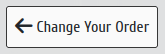 |
| | Checkout Form | The *Checkout Form* is expected to store the details of the user for order and payment processing. | Tested the feature by entering details and completing a test sale and checking the *Stripe* dashboard and the order database. | The feature behaved as expected, and and stored the user details for the sale passing them to *Stripe and the order database. | Test concluded and passed. |  |
| | Checkout Form | The *Save Info* checkbox is expected to save the details of the logged in user to their profile for future use. | Tested the feature by entering details and completing a test sale with the checkbox enabled while logged into the site. | The feature behaved as expected, and stored the user details to their profile for future. | Test concluded and passed. |  |
| | Checkout Form | The *Create Account* link is expected to open the signup page to create a user profile when no user is logged in. | Tested the feature by clicking the link. | The feature behaved as expected, and opened the signup page. | Test concluded and passed. |  |
| | Checkout Form | The *Login* link is expected to open the login page to allow a previous user to log in without creating new account details. | Tested the feature by clicking the link. | The feature behaved as expected, and opened the login page. | Test concluded and passed. | 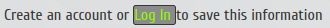 |
| | Checkout Form | The *Card Payment* input is expected to temporarily store the users card details for payment processing. | Tested the feature by entering test card details and processing a sale. | The feature behaved as expected, and temporarily stored the test card details before passing them to *Stripe for payment processing. | Test concluded and passed. |  |
| | Checkout Form | The *Complete Order* button is expected to process the order and pass payment details to *Stripe*. | Tested the feature by clicking the *Complete Order* button. | The feature behaved as expected, and processed the order saving the order details to the database (and user profile if logged in), passing the card details to *Stripe*, sending a confirmation email to the user and passing the user to an checkout success page displaying an order summary. | Test concluded and passed. |  |
| Checkout Success | | | | | | |
| | Order Summary | The *Continue Shopping* button is expected to return the user to the all designs page while saving the items already in the shopping bag. | Tested the feature by clicking the *Continue Shopping* button. | The feature behaved as expected, and returned the user to the all designs page saving the items already in the shopping bag. | Test concluded and passed. |  |
| Admin Panel | | | | | | |
| | Add Garment | The *Add Garment* button is expected to open the *Add Garment* page.| Tested the feature by clicking the *Add Garment* button. | The feature behaved as expected, and opened the *Add Garment* page. | Test concluded and passed. |  |
| | Edit Garment | The *Edit Garment* button is expected to open the *Garment Selection* page.| Tested the feature by clicking the *Edit Garment* button. | The feature behaved as expected, and opened the *Garment Selection* page. | Test concluded and passed. |  |
| | Add Category | The *Add Category* button is expected to open the *Add Category* page.| Tested the feature by clicking the *Add Category* button. | The feature behaved as expected, and opened the *Add Category* page. | Test concluded and passed. |  |
| | Edit Category | The *Edit Category* button is expected to open the *Category Selection* page.| Tested the feature by clicking the *Edit Category* button. | The feature behaved as expected, and opened the *Category Selection* page. | Test concluded and passed. |  |
| | Add Colour | The *Add Colour* button is expected to open the *Add Colour* page.| Tested the feature by clicking the *Add Colour* button. | The feature behaved as expected, and opened the *Add Colour* page. | Test concluded and passed. |  |
| | Edit Colour | The *Edit Colour* button is expected to open the *Colour Selection* page.| Tested the feature by clicking the *Edit Colour* button. | The feature behaved as expected, and opened the *Colour Selection* page. | Test concluded and passed. |  |
| | Add Size | The *Add Size* button is expected to open the *Add Size* page.| Tested the feature by clicking the *Add Size* button. | The feature behaved as expected, and opened the *Add Size* page. | Test concluded and passed. |  |
| | Edit Size | The *Edit Size* button is expected to open the *Size Selection* page.| Tested the feature by clicking the *Edit Size* button. | The feature behaved as expected, and opened the *Size Selection* page. | Test concluded and passed. |  |
| | Contact List | The *Contact List* button is expected to open the *Contact List* page.| Tested the feature by clicking the *Contact List* button. | The feature behaved as expected, and opened the *Contact List* page. | Test concluded and passed. |  |
| | Subscribers | The *Newsletter Subscribers* button is expected to open the *Newsletter Subscribers* page.| Tested the feature by clicking the *Subscribers* button. | The feature behaved as expected, and opened the *Newsletter Subscribers* page. | Test concluded and passed. |  |
| Add Garment and Edit Garment | | | | | | |
|  | Add and Edit Garment Forms | The *Add and Edit Garment* forms are expected to allow the admin of the site to add or edit a garment respectively by utilising the inputs and checkboxes in the forms. | Tested the features by completing the form of each and clicking the *Add or Edit Garment* button at the bottom of the form. | The *Add and Edit* Garment forms behaved as expected, and either added a new garment or edited an exisiting garment depending on the form selected for use. | Test concluded and passed. | 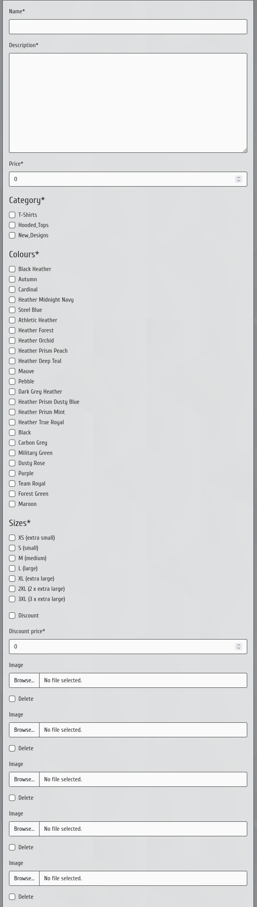 |
| | Add and Edit Garment Forms | The *Back to Garments* button is expected to return the user to the all designs page without saving any changes to the forms. | Tested the feature by clicking the *Back to Garments* button. | The feature behaved as expected, and returned the user to the all designs page. | Test concluded and passed. |  |
| | Add and Edit Garment Forms | The *Add and Edit Garment* buttons are expected to submit the form and add a new garment or edit and existing garment. | Tested the feature by clicking the *Add and Edit Garment* buttons in turn after completing the forms. | The feature behaved as expected, and either added a new garment or edited and existing garment dependant on form selected and then returned the user to the garment page of the added or edited garment. | Test concluded and passed. | 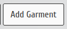 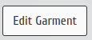 |
| Add and Edit Category, Colour and Size | | | | | | |
| | Add and Edit Category Forms | The *Add and Edit Category* forms are expected to allow the admin of the site to add new or edit existing categories dependant on the selected. | Tested by completing each of forms in turn and clicking on the add or edit button on the form. | The features behaved as expected and either added new or edited existing categories based on the selected. | Test concluded and passed. | 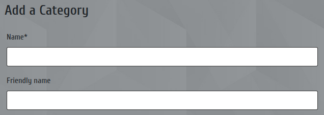  |
| | Add and Edit Category Forms | The *Add and Edit Category* buttons are expected to submit the form and add a new category or edit and existing category. | Tested the feature by clicking the *Add and Edit Category* buttons in turn after completing the forms. | The feature behaved as expected, and either added a new category or edited and existing category dependant on form selected and then returned the user to the category selection page of the added or edited category. | Test concluded and passed. |  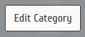 |
| | Add and Edit Colour Forms | The *Add and Edit Colour* forms are expected to allow the admin of the site to add new or edit existing colours dependant on the selected. | Tested by completing each of forms in turn and clicking on the add or edit button on the form. | The features behaved as expected and either added new or edited existing colours based on the selected. | Test concluded and passed. |   |
| | Add and Edit Colour Forms | The *Add and Edit Colour* buttons are expected to submit the form and add a new colour or edit and existing colour. | Tested the feature by clicking the *Add and Edit Colour* buttons in turn after completing the forms. | The feature behaved as expected, and either added a new colour or edited and existing colour dependant on form selected and then returned the user to the colour selection page of the added or edited colour. | Test concluded and passed. |   |
| | Add and Edit Size Forms | The *Add and Edit Size* forms are expected to allow the admin of the site to add new or edit existing sizes dependant on the selected. | Tested by completing each of forms in turn and clicking on the add or edit button on the form. | The features behaved as expected and either added new or edited existing sizes based on the selected. | Test concluded and passed. |   |
| | Add and Edit Size Forms | The *Add and Edit Size* buttons are expected to submit the form and add a new size or edit and existing size. | Tested the feature by clicking the *Add and Edit Size* buttons in turn after completing the forms. | The feature behaved as expected, and either added a new size or edited and existing size dependant on form selected and then returned the user to the size selection page of the added or edited size. | Test concluded and passed. |   |
| Edit Garment, Category, Colour and Size Selection | | | | | | |
| | Listed Item | The *Edit Category / Colour / Size* button is expected to open the respective edit page.| Tested the feature by clicking the *Edit Category / Colour / Size* button. | The feature behaved as expected, and opened the respective edit page. | Test concluded and passed. |     |
| | Listed Item | The *Delete Category / Colour / Size* button is expected to open the respective delete confirmation modal.| Tested the feature by clicking the *Delete Category / Colour / Size* button. | The feature behaved as expected, and opened the respective delete confirmation modal. | Test concluded and passed. |     |

